# Практика 10: Авторизация, куки и сессии

## Часть A. Подготовка и вёрстка

### Задание 1. Столбец password_hash

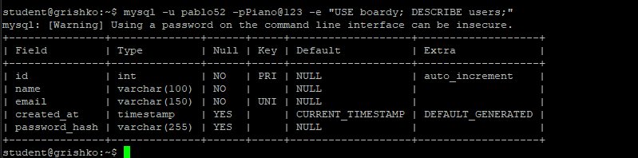

### Задание 2. Partials

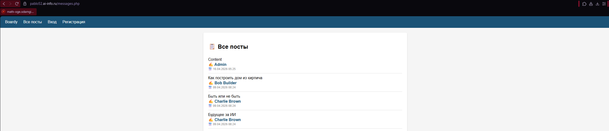

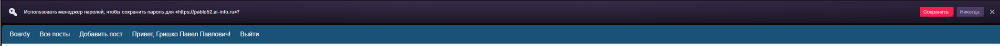

### Задание 3. Вёрстка форм

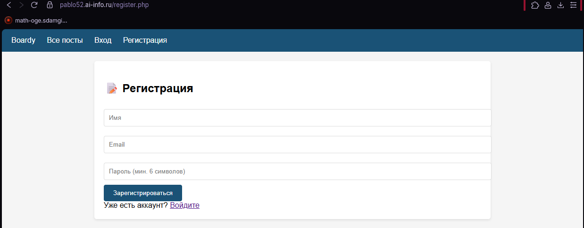

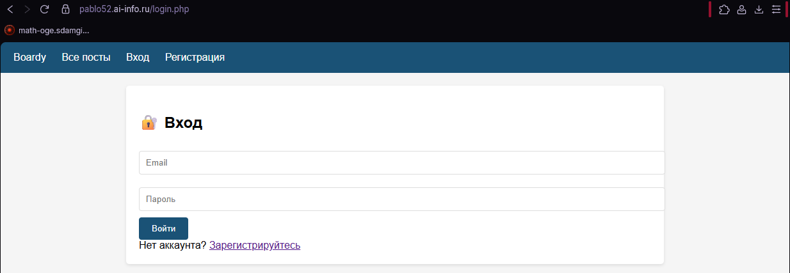

## Часть B. Регистрация и логин

### Задание 4. Регистрация

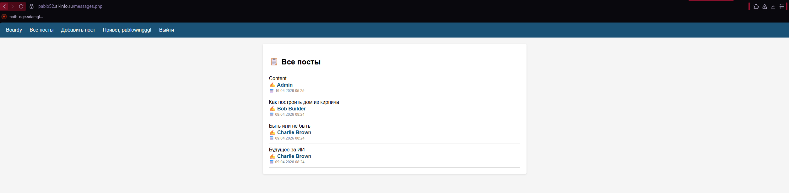

### Задание 5. Хеш в базе

### Задание 6. Защита от повторной регистрации

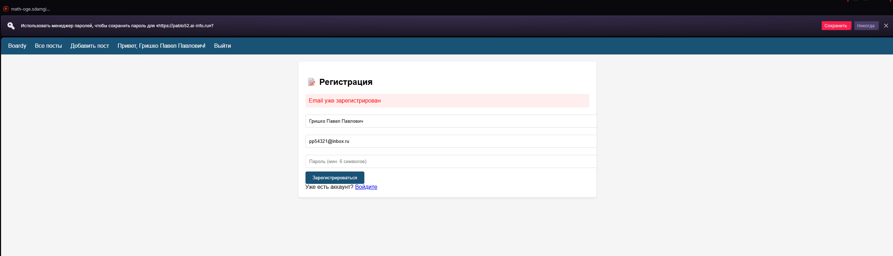

### Задание 7. Логин

### Задание 8. Неверный пароль

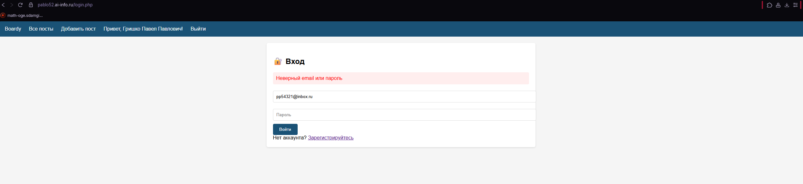

## Часть C. Куки и сессии

### Задание 9. Кука PHPSESSID

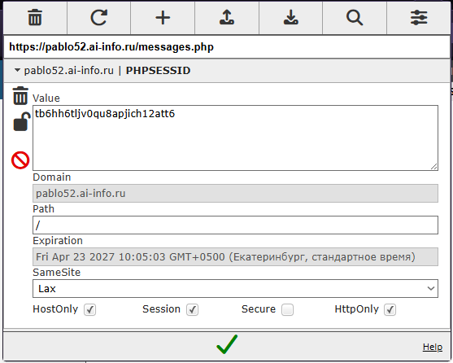

### Задание 10. Параметры куки

### Задание 11. HttpOnly на практике

### Задание 12. Файл сессии на сервере

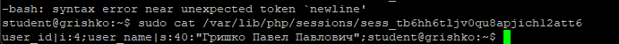

## Часть D. Защита и доработка

### Задание 13. Защита страниц

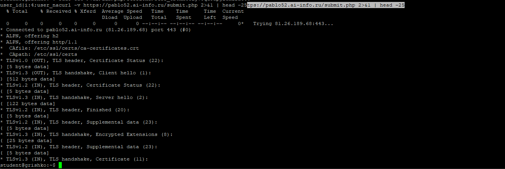

### Задание 14. Посты с автором

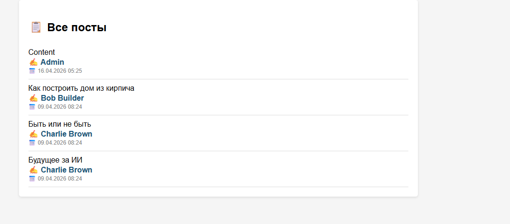

### Задание 15. Добавление поста

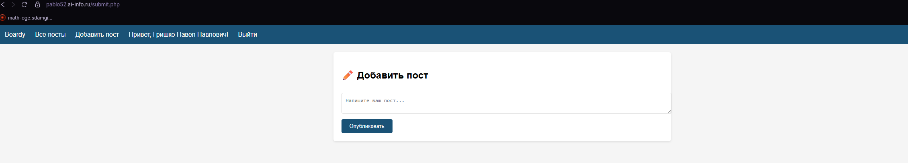

### Задание 16. Logout

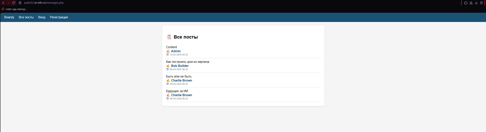

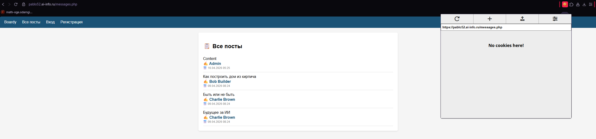

### Задание 17. Истёкшая сессия

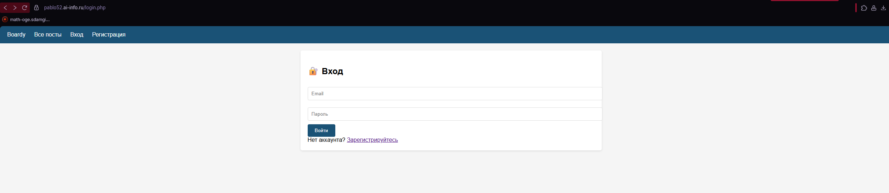
