# Практика 11: JWT для API и OAuth через GitHub

## Часть A. JWT для API

### Задание 1. auth.py

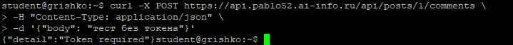

**Что означает «Bearer» в заголовке Authorization?**

«Bearer» — это схема аутентификации, указывающая, что токен является «bearer token». Любой, кто владеет этим токеном, может получить доступ к ресурсу. Префикс нужен, чтобы сервер понимал тип токена.

### Задание 2. /api/me.php

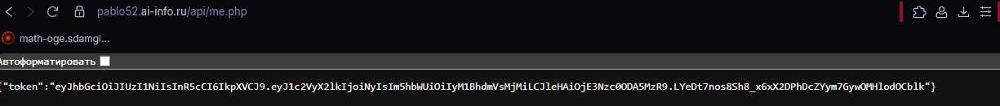

**Почему me.php использует session_start()?**

`session_start()` читает PHP-сессию по куке `PHPSESSID`. Это безопаснее, чем передавать логин/пароль каждый раз.

### Задание 3. React получает JWT

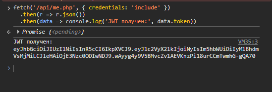

### Задание 4. Bearer в запросах

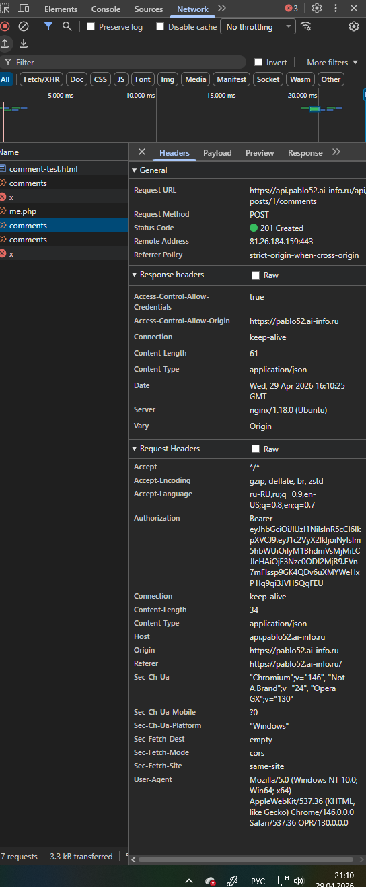

### Задание 5. Комментарий создан

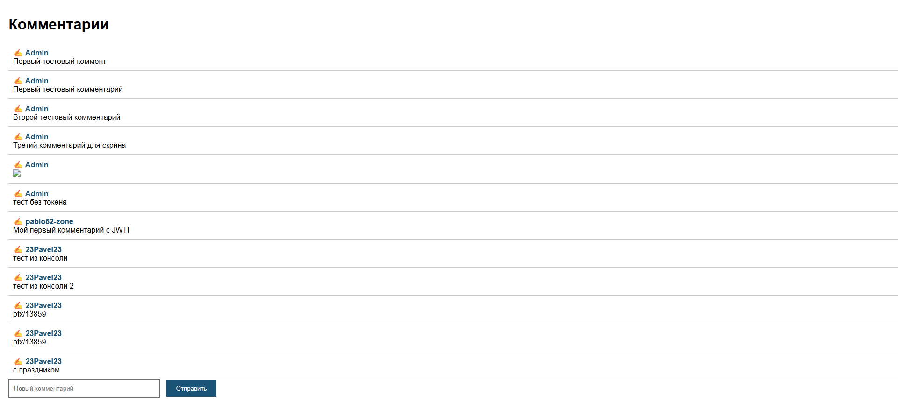

### Задание 6. jwt.io

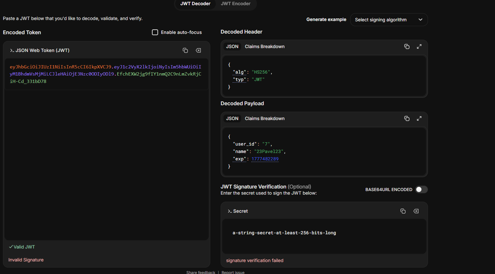

**Payload зашифрован или закодирован?**

Payload только закодирован в base64, не зашифрован. Злоумышленник может прочитать `user_id`, `name`, `exp`. Это не проблема, так как данные не секретные. Главная защита — подпись.

### Задание 7. Истёкший токен

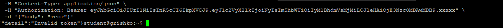

### Задание 8. Невалидный токен

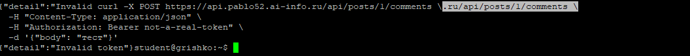

## Часть B. OAuth через GitHub

### Задание 9. OAuth App на GitHub

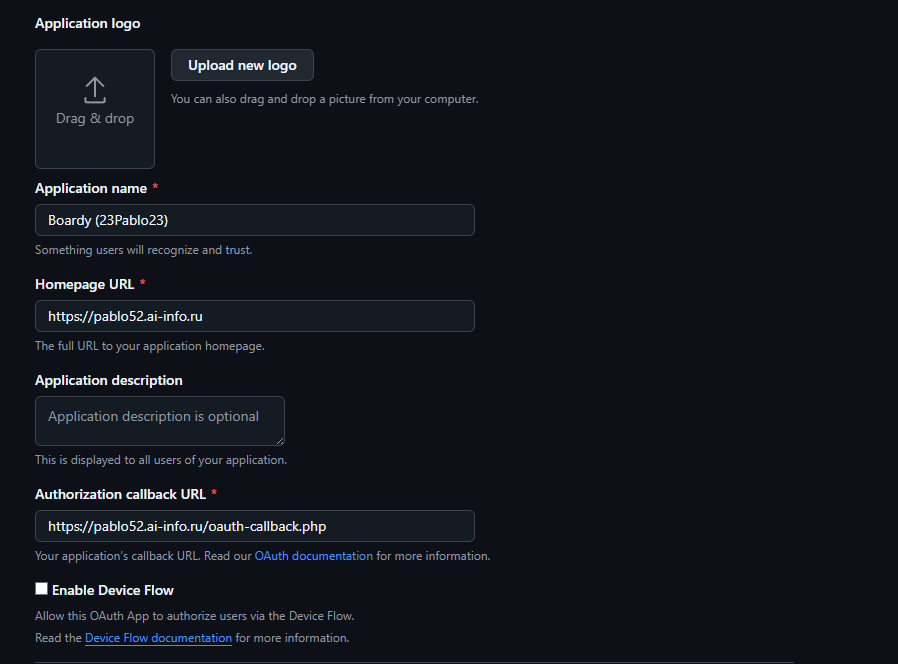

### Задание 10. Столбец github_id

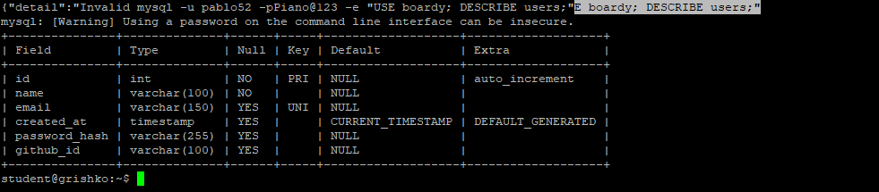

### Задание 11. Кнопка «Войти через GitHub»

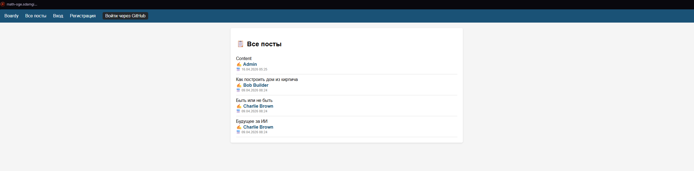

### Задание 12. Экран авторизации GitHub

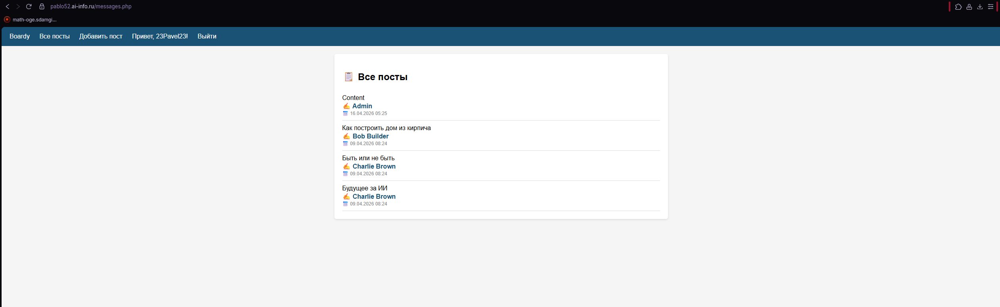

### Задание 13. После входа через GitHub

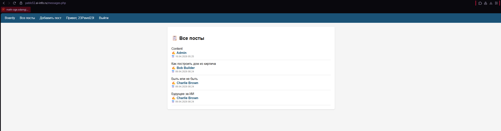

### Задание 14. github_id в базе

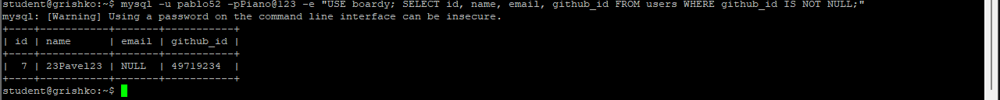

**Почему ищем по github_id, а не по email?**

`github_id` — уникальный и постоянный идентификатор. Email может измениться или отсутствовать.

### Задание 15. Комментарий от GitHub пользователя

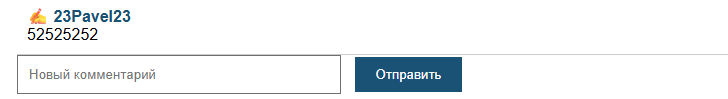

**Полный flow:**

1. Кнопка «Войти через GitHub» → редирект на GitHub
2. Пользователь нажимает Authorize
3. GitHub редиректит с code
4. Обмен code на access_token
5. Запрос профиля пользователя
6. Поиск/создание пользователя по github_id
7. Создание сессии
8. React получает JWT через /api/me.php
9. Отправка комментария с Bearer токеном
10. FastAPI создаёт комментарий

### Задание 16. Три способа входа

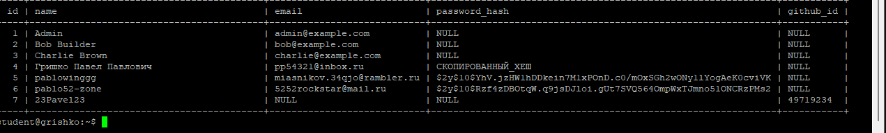

## Часть C. Анализ

### Задание 17. Сравнение механизмов

| Вопрос | Куки+сессии | JWT | OAuth |
|--------|-------------|-----|-------|
| Где хранятся данные? | На сервере | В токене | У провайдера |
| Кто прикрепляет к запросу? | Браузер | Клиент | GitHub |
| Для какого типа клиентов? | Браузер | API, кросс-домен | Внешние сервисы |
| Можно ли отозвать? | Да | Нет | Да |
| Кросс-доменно работает? | Нет | Да | Да |

### Задание 18. Баги и пакеты

Три бага в моём коде:

| Баг | Опасность | Решение |
|-----|-----------|---------|
| Секретный ключ в коде | Утечка через git | Переменные окружения |
| Нет отзыва токенов | Токен работает после блокировки | Passport |
| Нет refresh токенов | Истёк JWT → логин заново | Passport |
