# Практика 13: WebSocket (реалтайм-лента)

## Часть A. FastAPI: WebSocket

### Задание 1. ConnectionManager
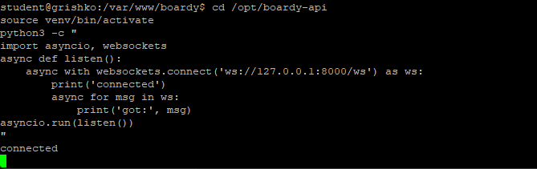

### Задание 2. /internal/broadcast
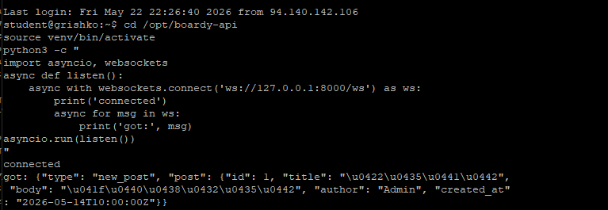

### Задание 3. Два клиента
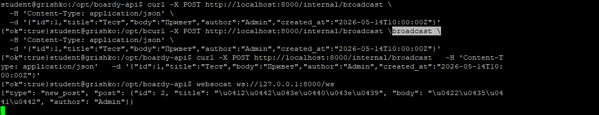

## Часть B. Laravel: HTTP-callback

### Задание 4. PostController
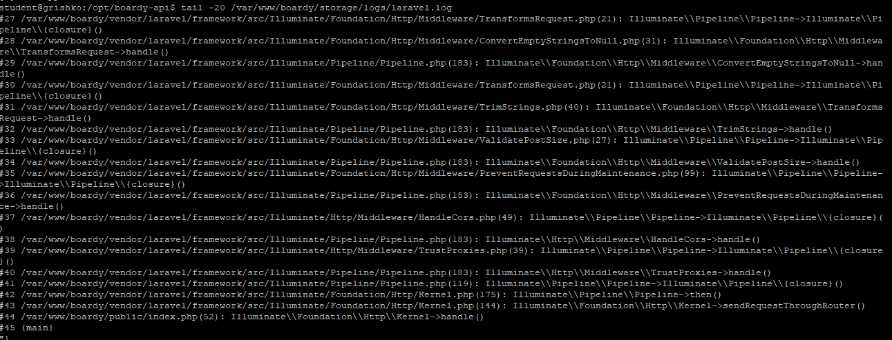

### Задание 5. Проверка callback
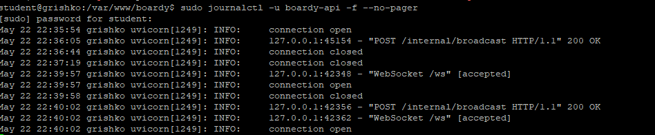

## Часть C. JS клиент

### Задание 6. WebSocket в Blade
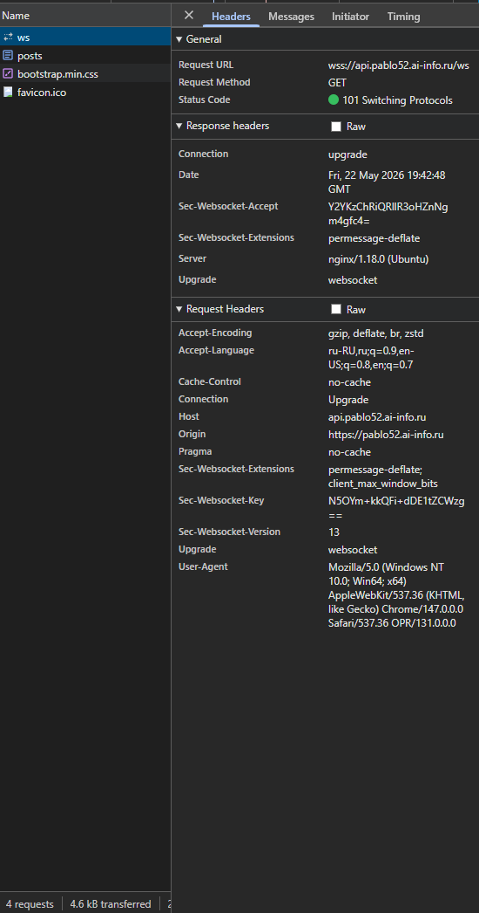

### Задание 7. Два браузера
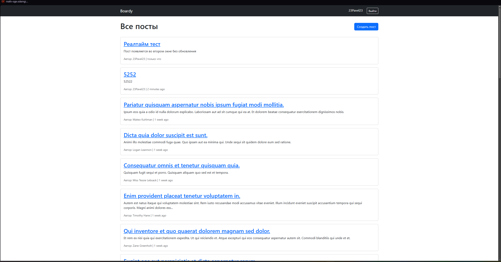

### Задание 8. DevTools frame
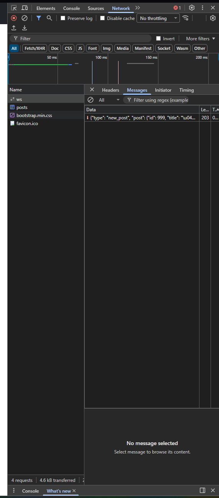

### Задание 9. XSS
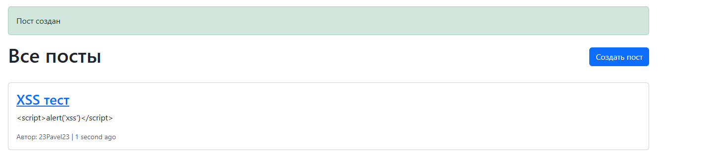

### Задание 10. Переподключение
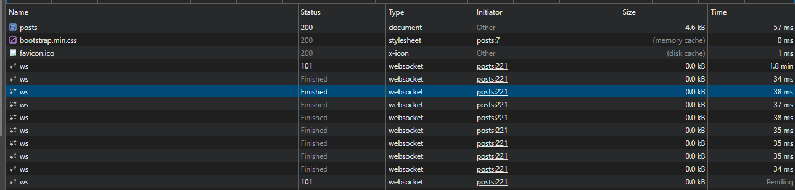

## Часть D. Nginx

### Задание 11. WS-проксирование
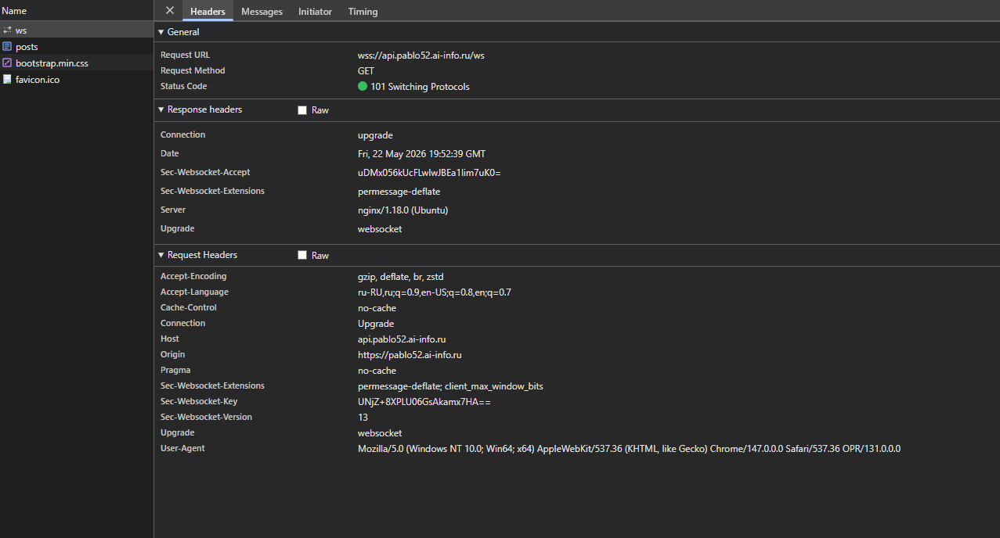

### Задание 12. Закрыть /internal
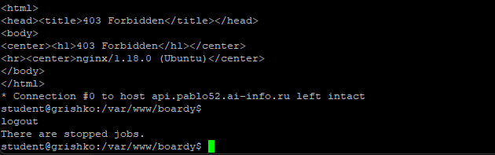
