# Практика 14: Финальная микросервисная архитектура

## Часть A. Passport как OAuth 2.1 сервер

### Задание 1. Установка и SPA-клиент
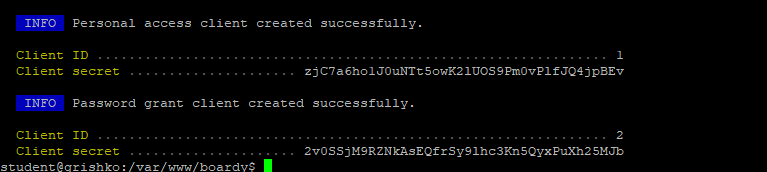
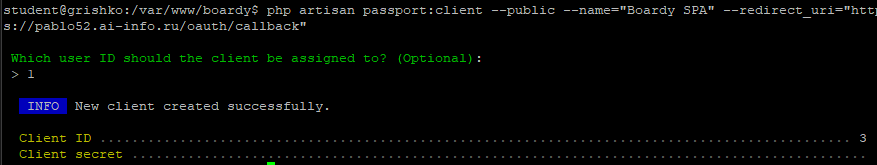

### Задание 2. TTL и refresh
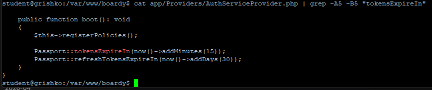

### Задание 3. Проверка выдачи через curl
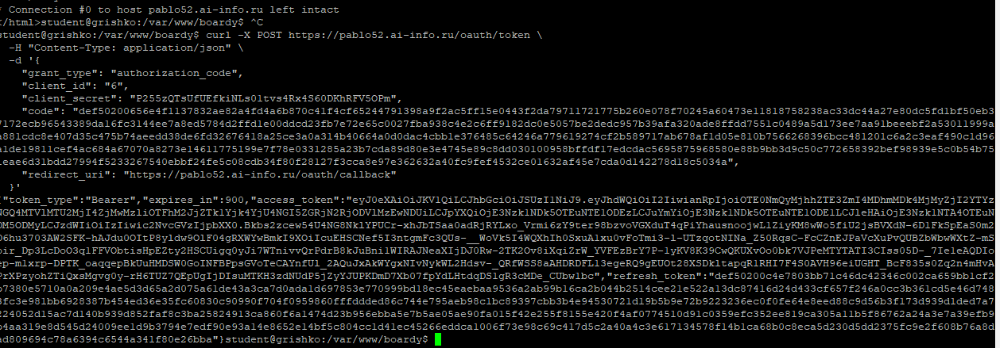

## Часть Б. Две базы данных

### Задание 4. Создание boardy_api
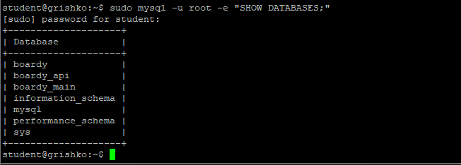
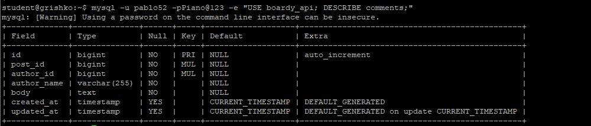

### Задание 5. FastAPI подключён к новой БД
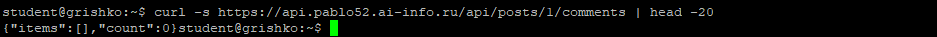

## Часть В. FastAPI: RS256 + полный CRUD

### Задание 6. RS256 проверка
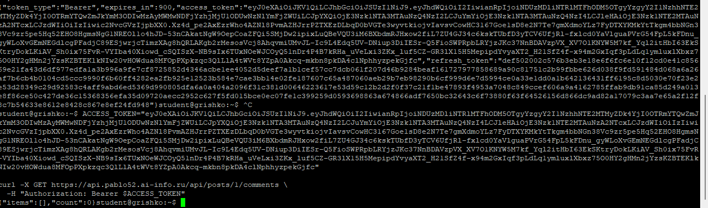
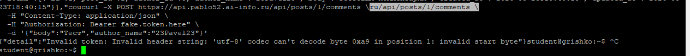

### Задание 7. Полный CRUD с author_name
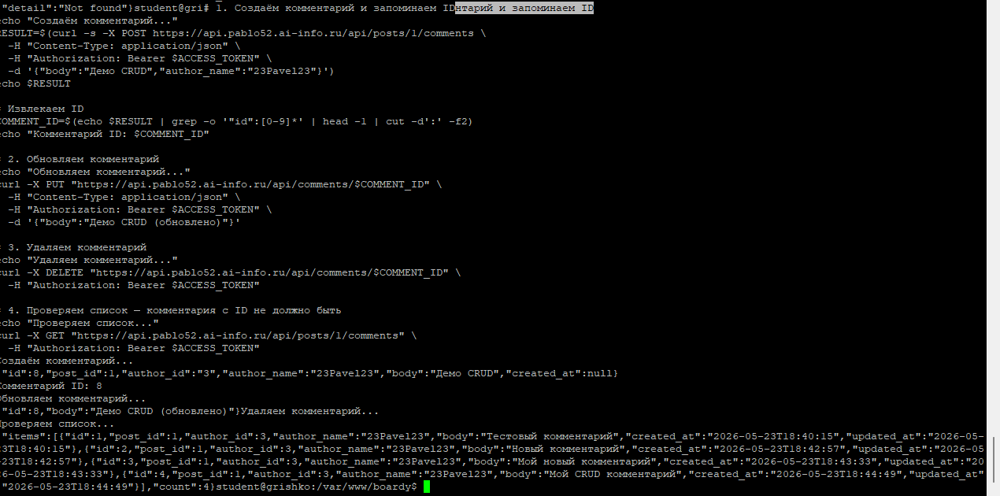

### Задание 8. Owner check
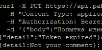

### Задание 9. CORS
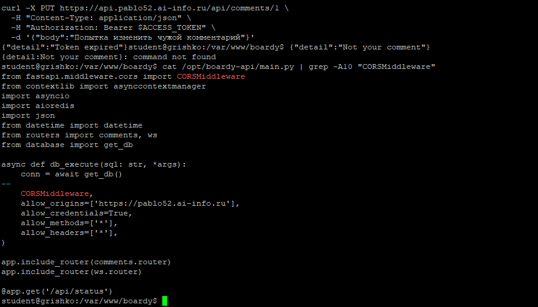

## Часть Г. React PKCE flow

### Задание 10. PKCE утилиты
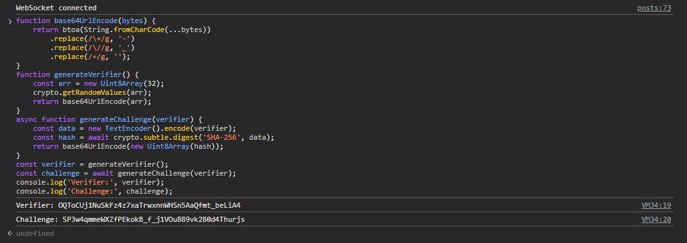

### Задание 11. Login flow
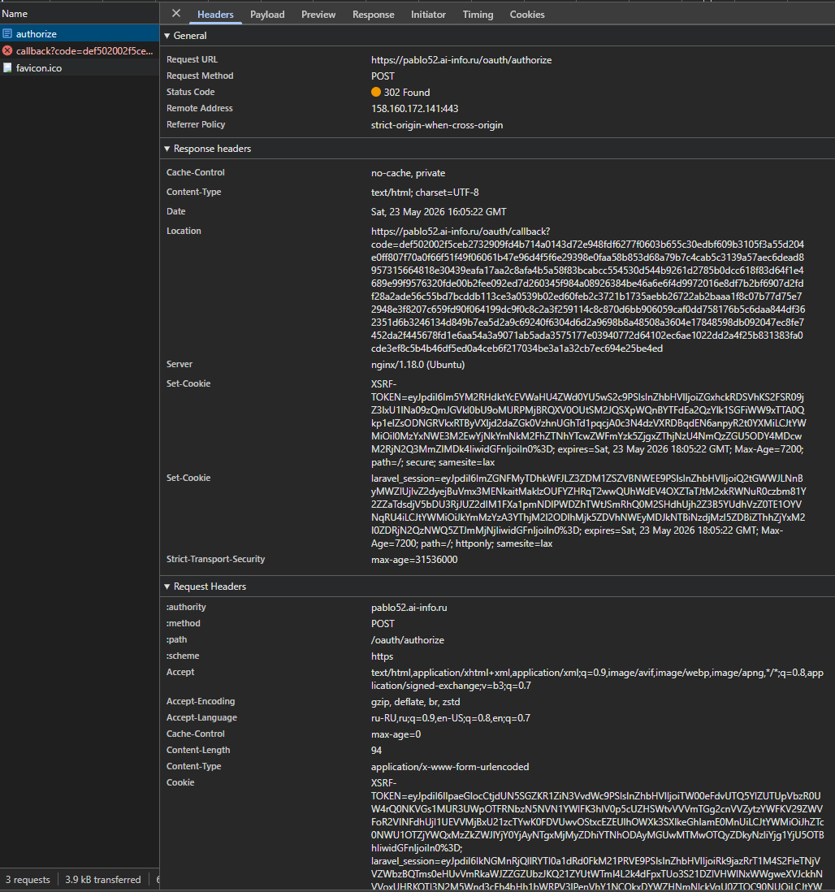
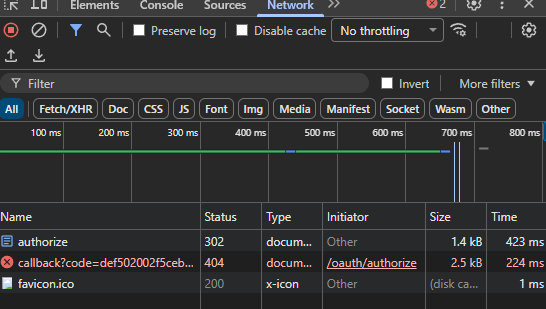

### Задание 12. Обмен code на токены
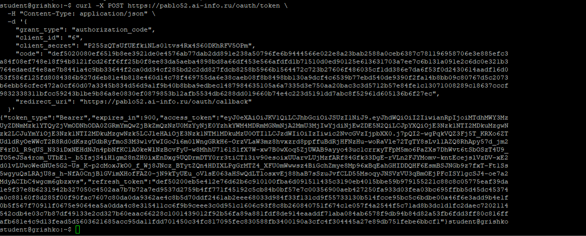

### Задание 13. Refresh token в HttpOnly cookie
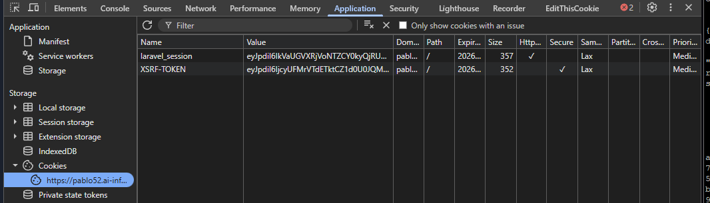

### Задание 14. Silent refresh
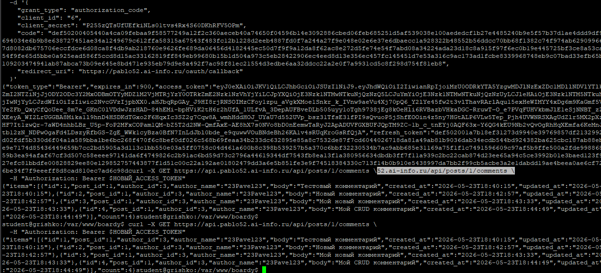

## Часть Д. Redis Pub/Sub

### Задание 15. Redis установлен
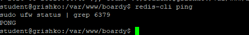

### Задание 16. Laravel publish new_post
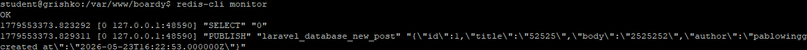

### Задание 17. FastAPI subscriber на new_post
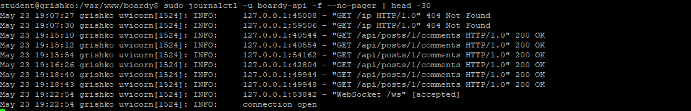
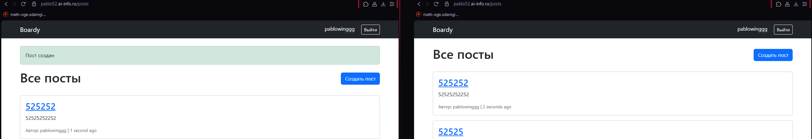

### Задание 18. User observer и user.renamed
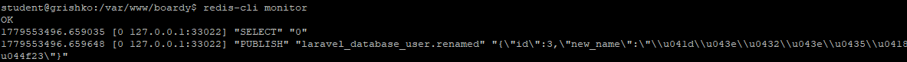

### Задание 19. Денормализация имени
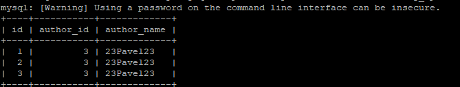
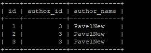

## Часть Е. Финальные проверки

### Задание 20. Два браузера: посты в реалтайме
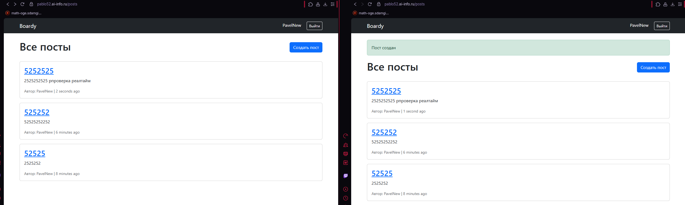

### Задание 21. Два браузера: комментарии в реалтайме
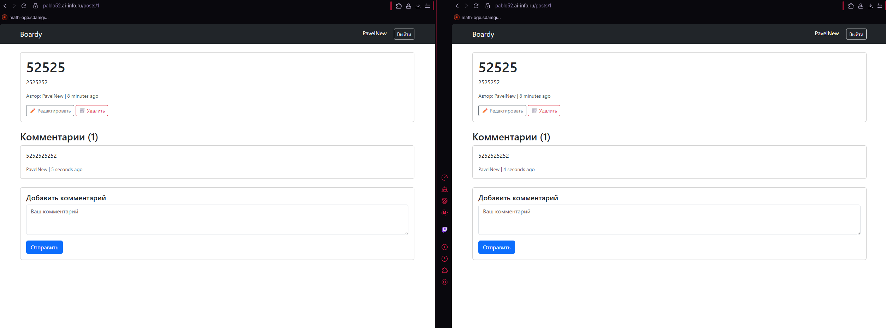

### Задание 22. Никаких прямых HTTP-вызовов
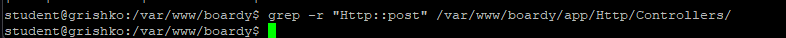
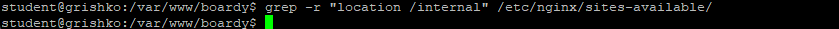
