# Практика 15: Docker и Docker Compose

## Часть A. Dockerfile для Laravel

### Задание 1. PHP-FPM с расширениями
PHP-FPM используется вместо Apache — разделение ответственности. Nginx сам решает когда передать запрос PHP процессу, что даёт лучшую производительность.
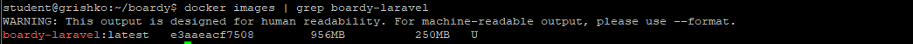

### Задание 2. Кеширование composer-зависимостей
Если COPY всего проекта сделать ДО composer install — при любом изменении кода Docker пересобирает слой зависимостей заново. При правильном порядке слой кешируется.
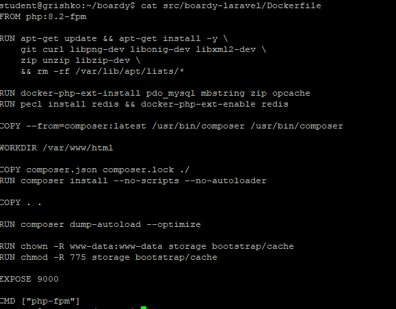

### Задание 3. .dockerignore
Если не исключить .env — пароли и секретные ключи попадут внутрь образа и могут утечь через Docker Hub.
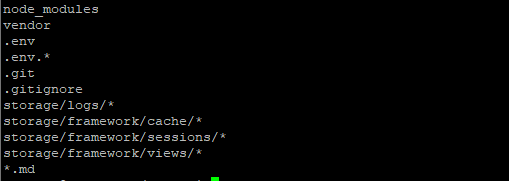

## Часть Б. Dockerfile для FastAPI

### Задание 4. requirements.txt
Версии фиксируем чтобы через год pip install не сломал приложение обновлением с breaking changes.
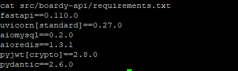

### Задание 5. Сборка образа
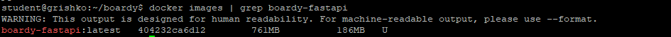

### Задание 6. CMD с правильным host
С --host 127.0.0.1 uvicorn слушает только внутри контейнера. Другие контейнеры не могут достучаться. --host 0.0.0.0 открывает все интерфейсы.
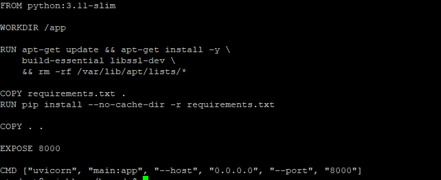

## Часть В. Конфиг Nginx

### Задание 7. docker/nginx/default.conf
laravel:9000 — имя контейнера из docker-compose. Docker резолвит имена контейнеров через встроенный DNS внутри сети boardy_net.
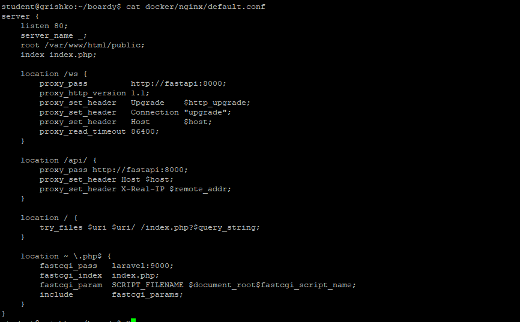

### Задание 8. WebSocket location
proxy_http_version 1.1, Upgrade и Connection "upgrade" обязательны для WebSocket. proxy_read_timeout 86400 держит соединение 24 часа.
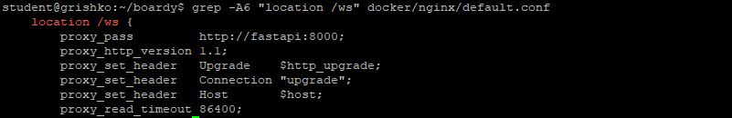

## Часть Г. docker-compose.yml

### Задание 9. Пять сервисов
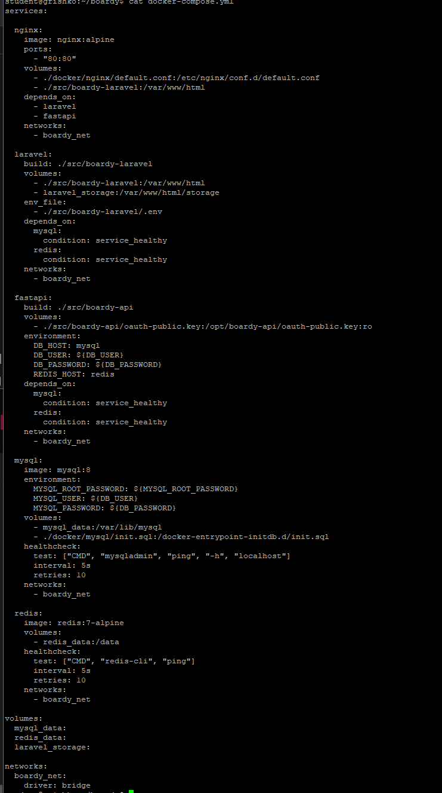

### Задание 10. Volumes
Без mysql_data volume данные MySQL удалятся при docker compose down. Именованный volume хранится в Docker, bind-mount — папка на хосте.
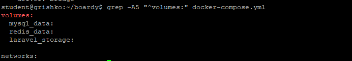

### Задание 11. Healthcheck для MySQL и Redis
depends_on без healthcheck не гарантирует что MySQL готов принимать подключения — контейнер может быть запущен но MySQL ещё инициализируется. Возникает race condition.
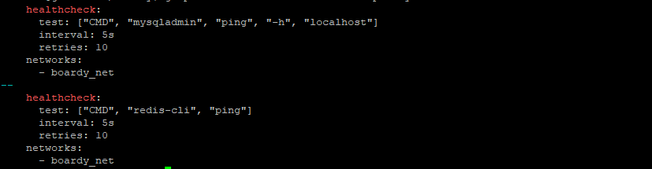

### Задание 12. init.sql для двух БД
init.sql выполняется только при первом запуске — когда volume пустой. При повторных запусках volume уже инициализирован и файл игнорируется.
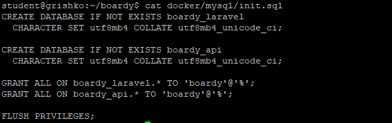
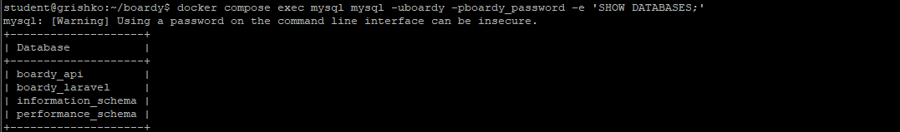

### Задание 13. Два .env файла
Корневой .env — переменные для docker-compose (пароли БД). boardy-laravel/.env — переменные Laravel. DB_HOST=mysql потому что внутри сети Docker имя контейнера резолвится в IP.
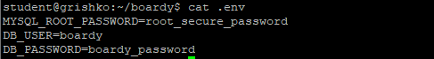
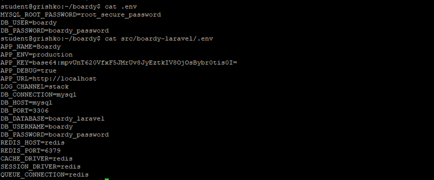

## Часть Д. Запуск и проверка

### Задание 14. docker compose up
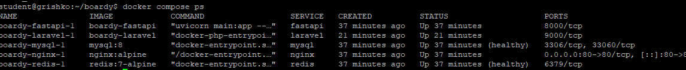

### Задание 15. Миграции в контейнере
docker compose exec выполняет команду в уже запущенном контейнере. docker compose run создаёт новый временный контейнер.
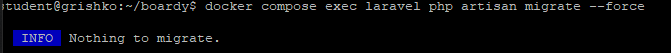
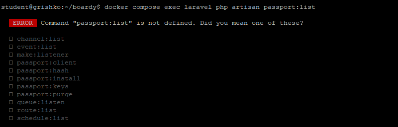

### Задание 16. Приложение работает
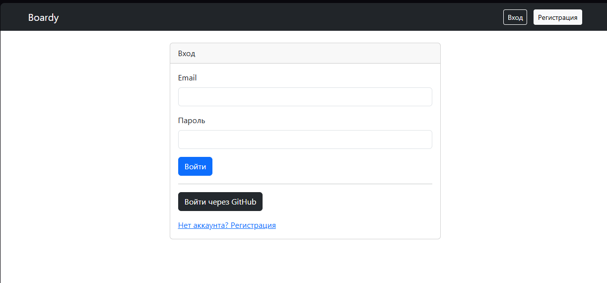
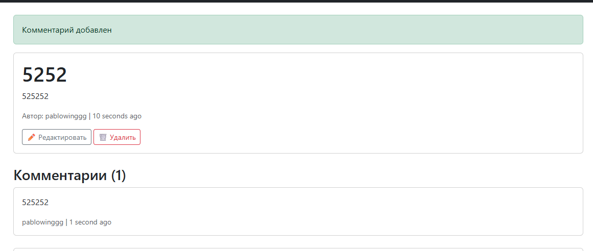

### Задание 17. Реалтайм работает
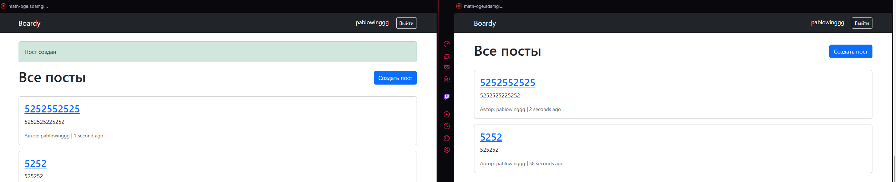
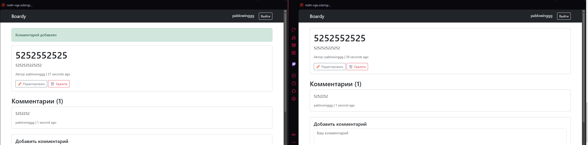

### Задание 18. Данные переживают перезапуск
docker compose down -v удаляет volumes вместе с данными. Без -v данные сохраняются в именованных volumes.
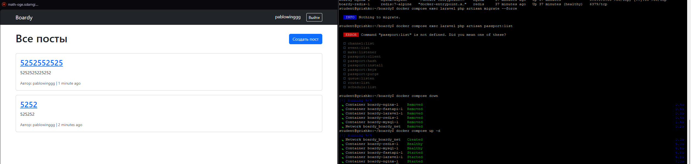

### Задание 19. Централизованные логи
Docker собирает логи всех сервисов в одном месте. Не нужно заходить на сервер и искать /var/log/* для каждого сервиса отдельно.
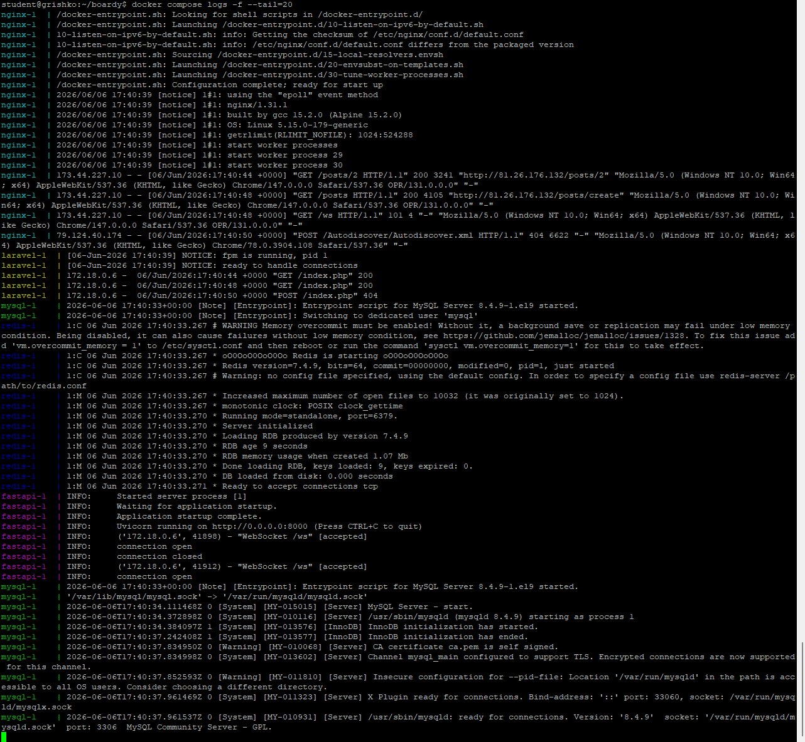

### Задание 20. Чистая машина
Команда от клона до рабочего приложения: git clone → docker compose up -d
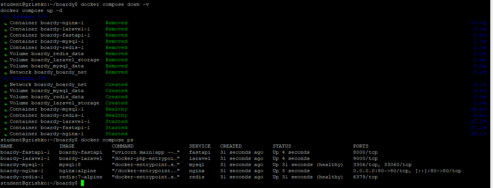
