# Практика 16: CI/CD через GitHub Actions

## Часть A. CI: lint + smoke

### Задание 1. Скелет workflow
CI workflow запускается на pull_request в main и push в main/dev.
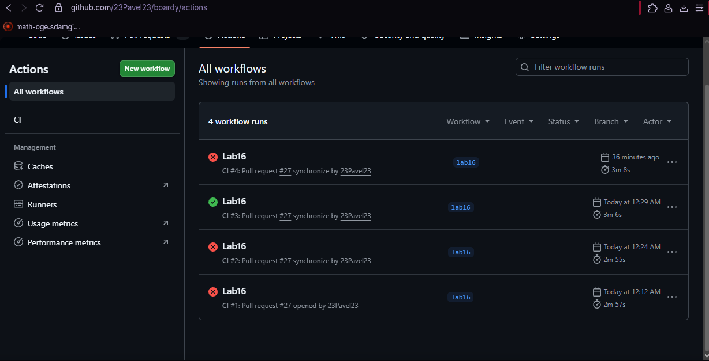

### Задание 2. Lint
Lint стоит первым потому что это самая быстрая проверка — синтаксис. Ловит битый код до запуска тяжёлых шагов (fail fast). Не ловит логические ошибки и runtime-баги.
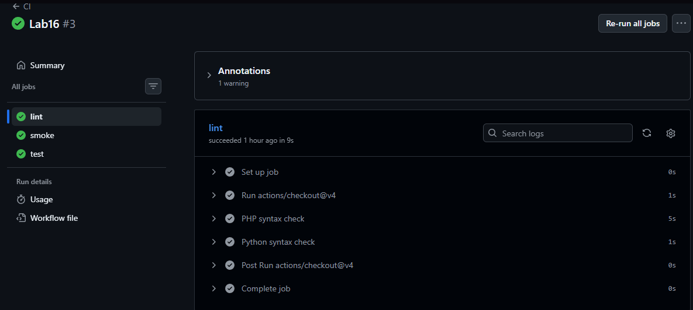

### Задание 3. /health эндпоинты
Отдельный /health нужен потому что обычные эндпоинты требуют авторизацию, БД, бизнес-логику. /health — простой ответ без зависимостей. В проде его смотрит load balancer, оркестратор (k8s liveness probe), мониторинг.
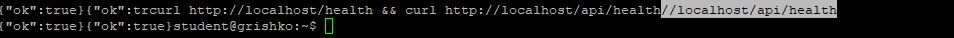

### Задание 4. Smoke-check
Smoke ловит: (1) образы не собираются, (2) compose битый или сервисы не видят друг друга, (3) приложение не отвечает на HTTP. Не ловит: логические баги, граничные случаи, производительность.
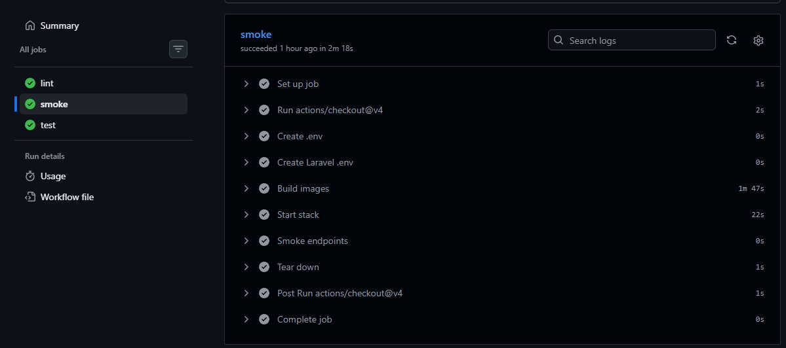

## Часть B. Минимальные тесты и блокировка

### Задание 5. PHPUnit-тест на /health
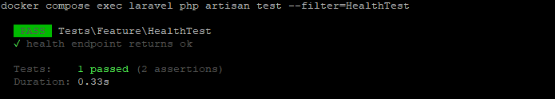

### Задание 6. pytest-тест на /health
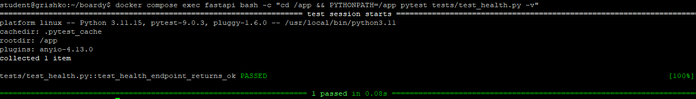

### Задание 7. Job test в CI
test после smoke потому что нет смысла гонять тесты если стек не поднимается. Если поменять местами — тесты будут падать с непонятными ошибками подключения вместо чёткого "стек не собрался".
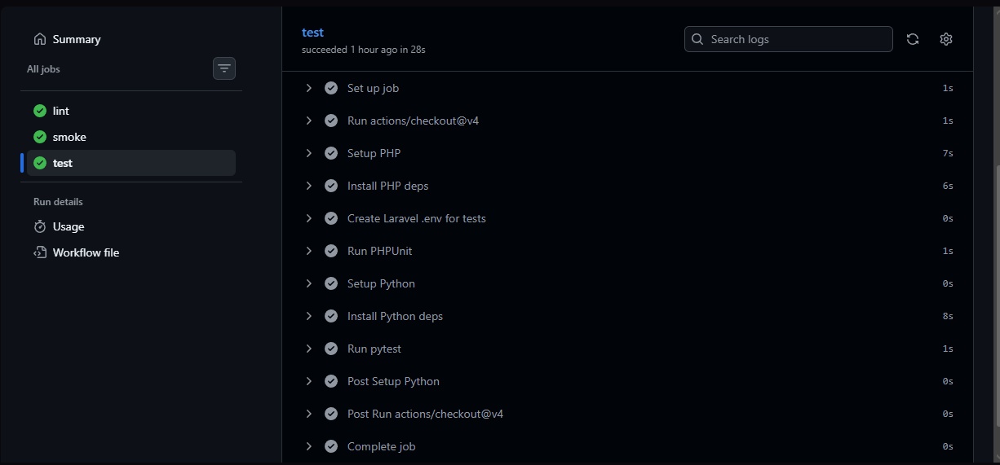

### Задание 8. Блокировка сборки сломанным тестом
При ручном деплое: сломали код → запушили → ssh на сервер → git pull → docker compose up → сайт сломан → ищем причину. CI сэкономил минимум 10-15 минут и предотвратил поломку прода.
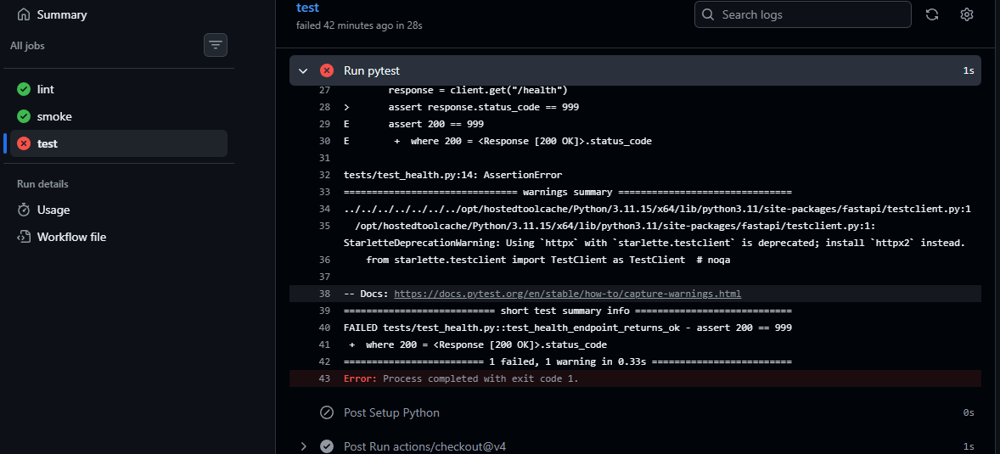
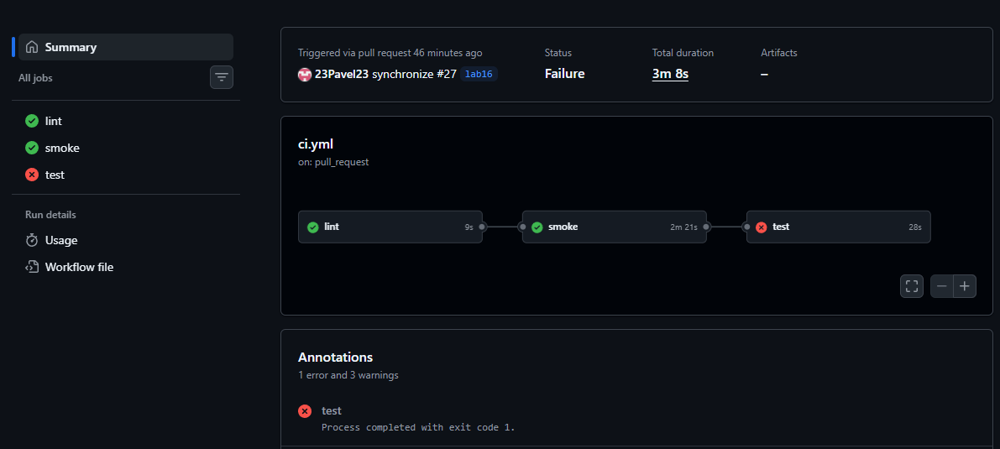
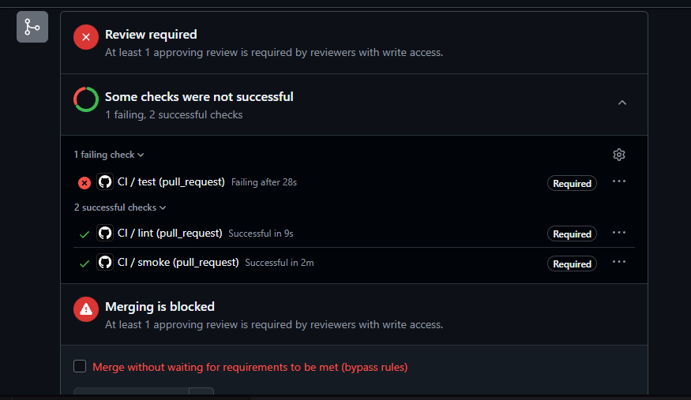

### Задание 9. Где смотреть логи
1. Открыть вкладку Actions на GitHub
2. Кликнуть на нужный run
3. В левой панели кликнуть на job "test"
4. Раскрыть шаг "Run pytest" или "Run PHPUnit"
5. Найти строку с assert — там точный файл и номер строки

### Задание 10. Защита ветки main
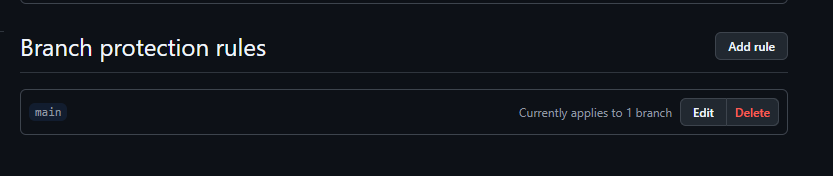

## Часть C. Сборка и реестр

### Задание 11. Workflow деплоя
Сборка и деплой в отдельном файле потому что deploy.yml триггерится только на push в main, ci.yml — на каждый PR. Повтор lint/smoke/test в deploy.yml нужен чтобы даже прямой push в main (минуя PR) прошёл проверки.

### Задание 12. Login в GHCR
GITHUB_TOKEN создаётся автоматически на каждый запуск. Отличия от обычного secret: (1) не нужно создавать руками, (2) автоматически истекает после завершения workflow.
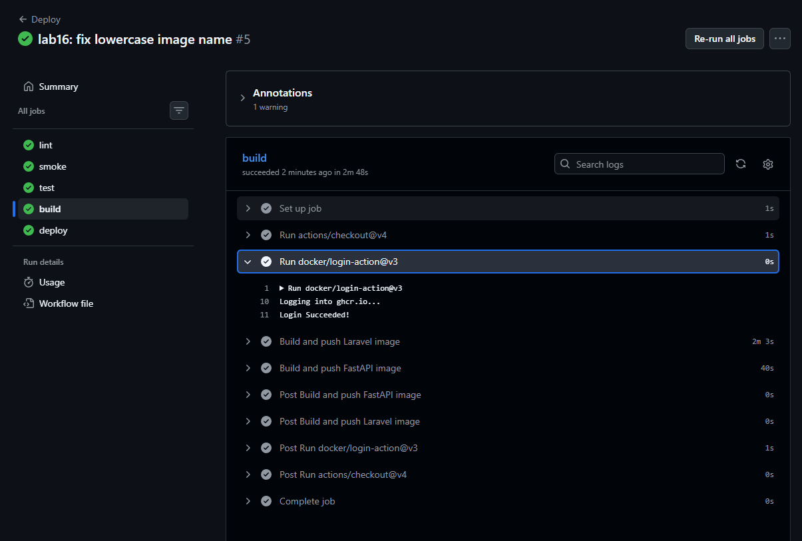

### Задание 13. Сборка и push образов
Два тега: SHA — точная версия для отката, latest — для удобного docker compose pull на сервере.
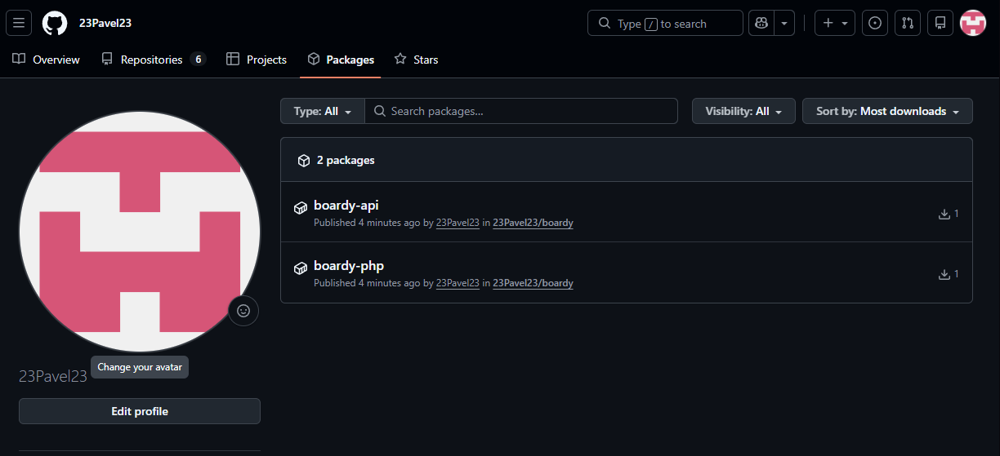

## Часть D. Автодеплой и полный прогон

### Задание 14. compose тянет из GHCR
В практике 15 был build: ./src/boardy-laravel — сервер сам собирал образы. Теперь image: ghcr.io/... — сервер только скачивает готовый образ. Сборка ушла в CI потому что сервер не должен тратить ресурсы на компиляцию.
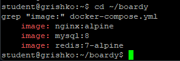

### Задание 15. SSH-ключ деплоя и секреты
Отдельный ключ для деплоя — не личный. Если утечёт: отзываем только deploy_key, личный доступ цел. Удаляем публичный ключ с сервера, генерируем новый.
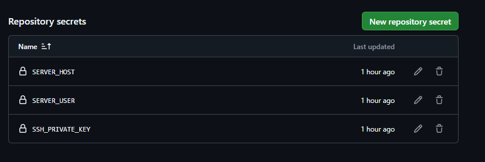

### Задание 16. Job deploy
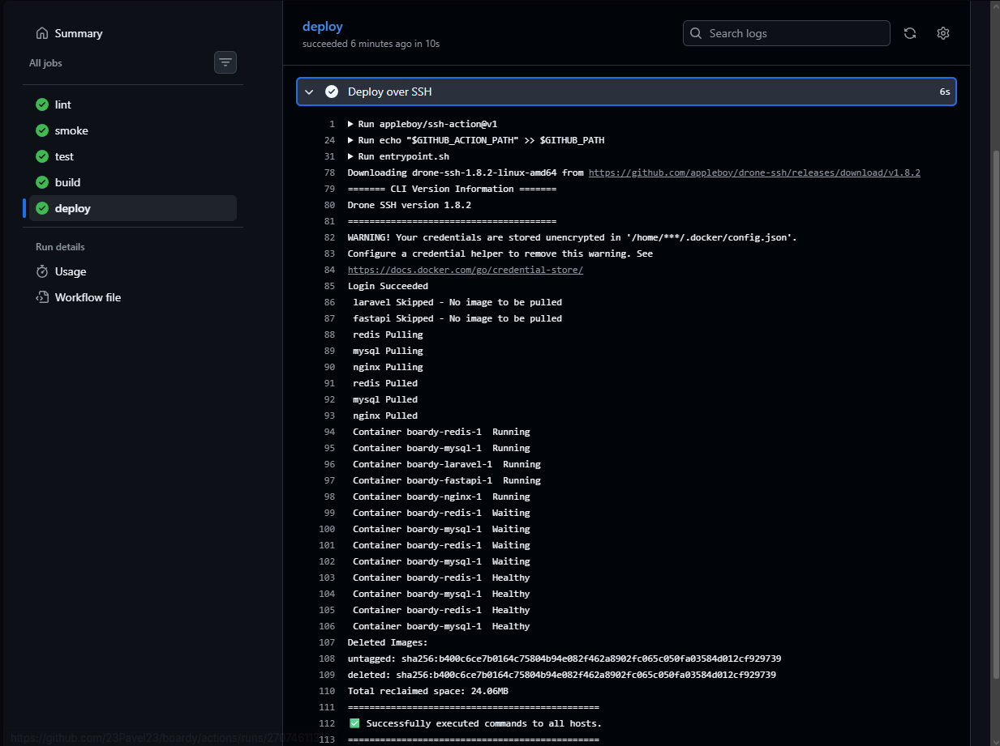

### Задание 17. Полный pipeline
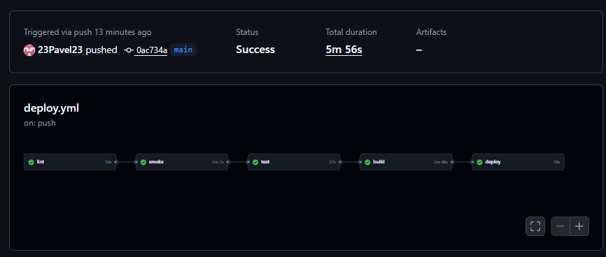
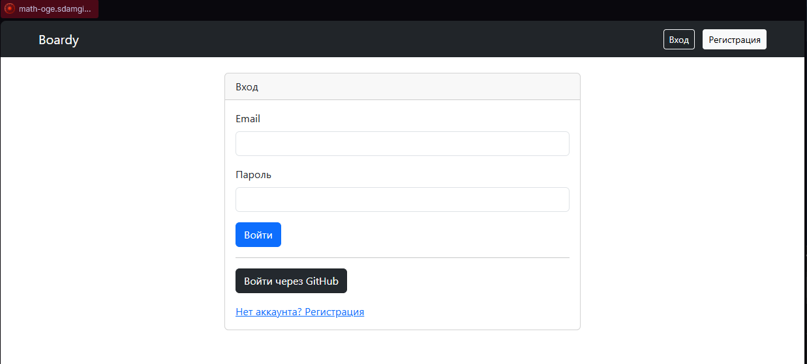

### Задание 18. Откат
```bash
docker compose stop laravel
docker pull ghcr.io/23pavel23/boardy-php:SHA_ПРЕДЫДУЩЕГО_КОММИТА
docker tag ghcr.io/23pavel23/boardy-php:SHA_ПРЕДЫДУЩЕГО_КОММИТА ghcr.io/23pavel23/boardy-php:latest
docker compose up -d
```
Не нужно ничего пересобирать — образ уже готов в GHCR, просто тянем нужный тег.

### Задание 19. Безопасность пайплайна
1. Версию action лучше пинить по SHA потому что тег (v3) может быть переписан злоумышленником — SHA неизменна.
2. pull_request_target имеет доступ к секретам репозитория — недоверенный код из форка может украсть токены.
3. Self-hosted runner в публичном репо опасен — любой может открыть PR и выполнить произвольный код на вашем сервере.

### Задание 20. Карта курса
- Практика 1: Создание виртуальной машины Linux — научились работать с сервером и командной строкой
- Практика 2: SSH, VPS, Git — подключились к серверу, начали версионировать код
- Практика 3: NGINX, DNS — настроили веб-сервер и домен
- Практика 4: HTTP — разобрались как браузер общается с сервером
- Практика 5: HTTPS — зашифровали трафик через SSL сертификат
- Практика 6: CGI — первые динамические страницы через скрипты
- Практика 7: PHP-FPM и FastAPI — два бэкенда на PHP и Python
- Практика 8: MySQL — добавили постоянное хранилище данных
- Практика 9: REST API SSR vs CSR — отдаём JSON, разделили фронт и бэк
- Практика 10: Куки и сессии — сохраняем состояние пользователя
- Практика 11: JWT и OAuth — безопасная авторизация между сервисами
- Практика 12: Установка Laravel — полноценный PHP фреймворк с MVC
- Практика 13: WebSocket — реалтайм без перезагрузки страницы
- Практика 14: Redis — кеш и pub/sub для быстрой передачи событий
- Практика 15: Docker — упаковали всё в контейнеры, одна команда запускает всё
- Практика 16: CI/CD — автоматические проверки и деплой без ручных команд
