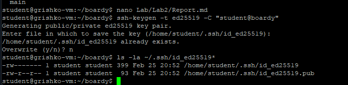 - Генерация SSH-ключа
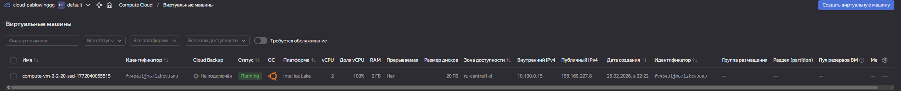 - Подключение к ВМ
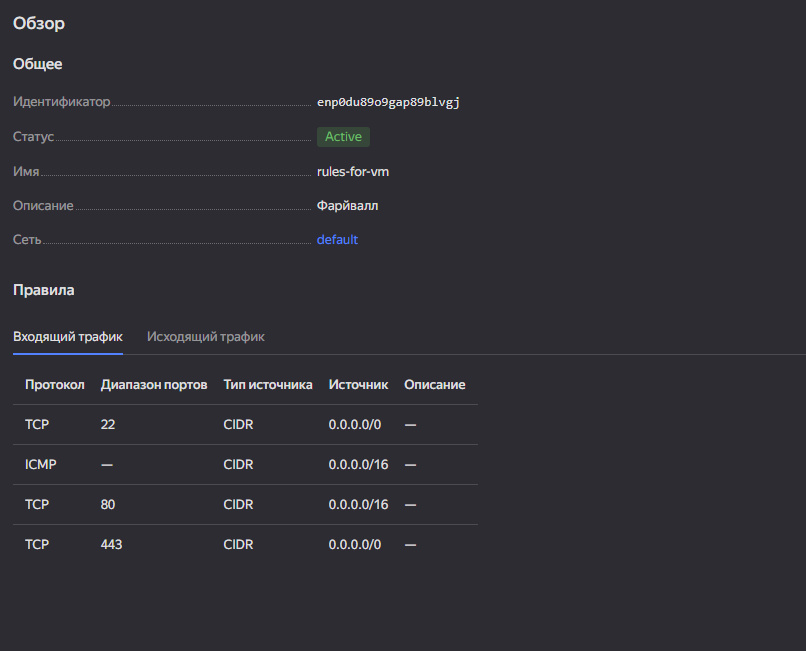 - Настройка файрвола — входящее правило
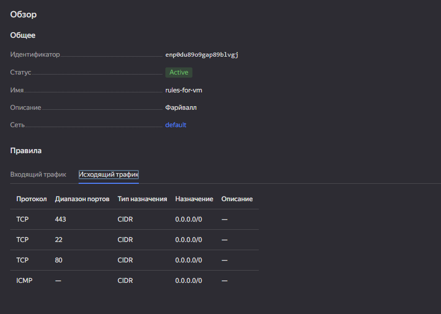 - Настройка файрвола — исходящее правило
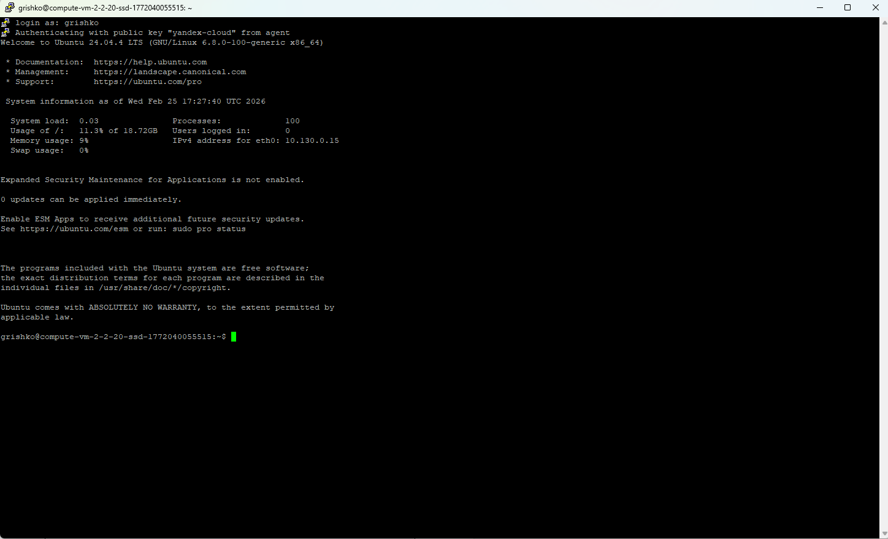 - Подключение через PuTTY
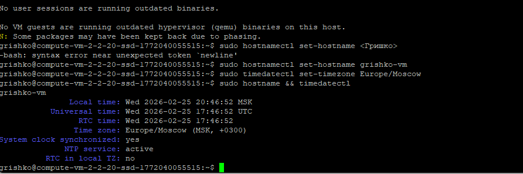 - Изменение hostname
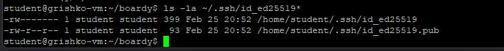 - Создание пользователя student
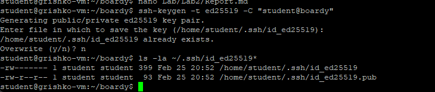 - Настройка Git
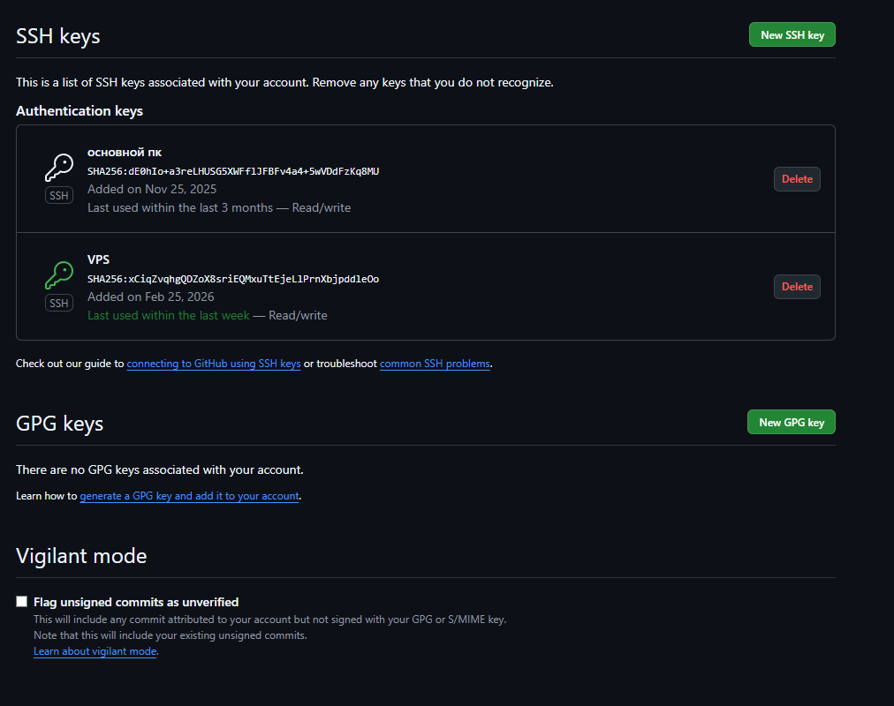 - Проверка SSH-подключения к GitHub
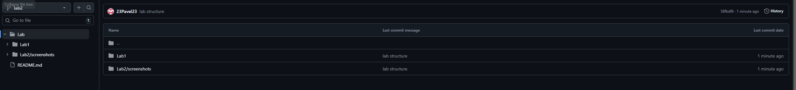 - Репозиторий на GitHub
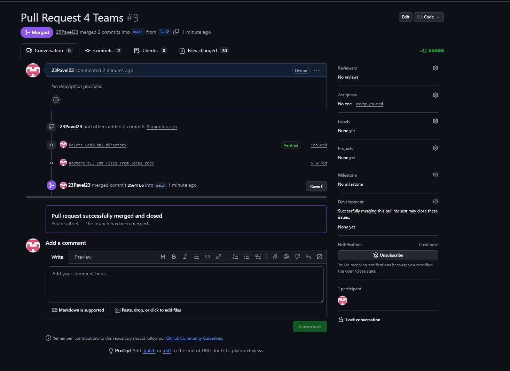 - Создание Pull Request
