## 1. Настройка виртуального хоста основного сайта

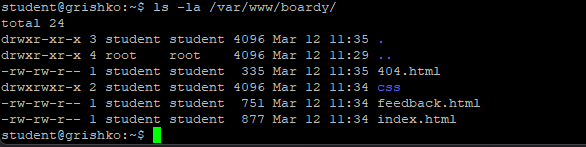 — Создание `/var/www/boardy` и передача прав пользователю student

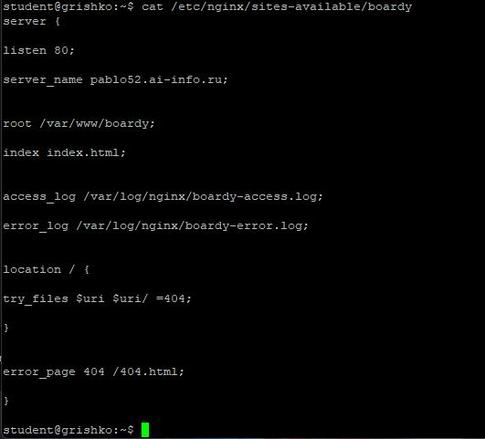 — Конфиг `/etc/nginx/sites-available/boardy` с директивами server_name, root, access_log, error_log, error_page

## 2. Страницы проекта

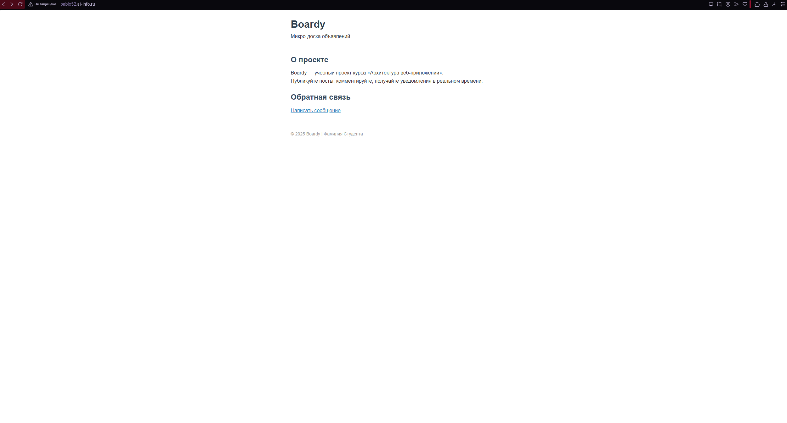 — Лендинг Boardy в браузере (домен виден в адресной строке)

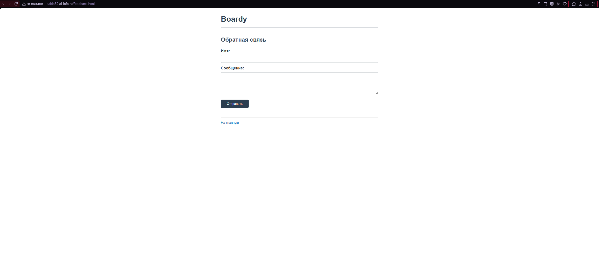 — Форма с полями "Имя" и "Сообщение", кнопка "Отправить"

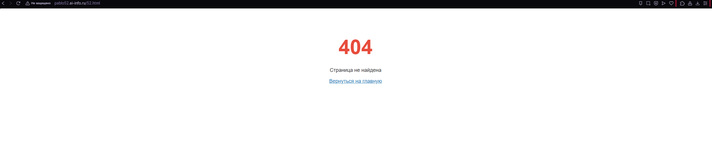 — Страница 404 с подключенным CSS (URL несуществующей страницы виден)

## 3. Настройка поддомена API

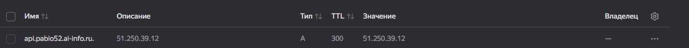 — A-запись для поддомена `api.pablo52.ai-info.ru` (IP, TTL видны)

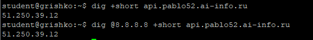 — Вывод `dig +short api.pablo52.ai-info.ru` (IP сервера)

## 4. Исследование виртуальных хостов

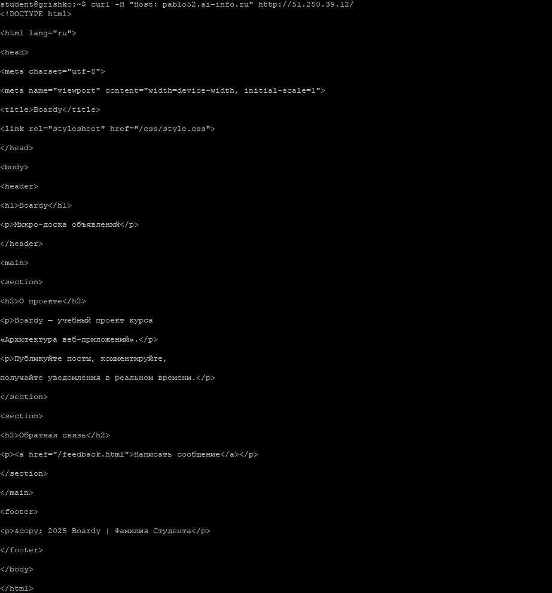 — GET-запрос к основному домену (лендинг Boardy)

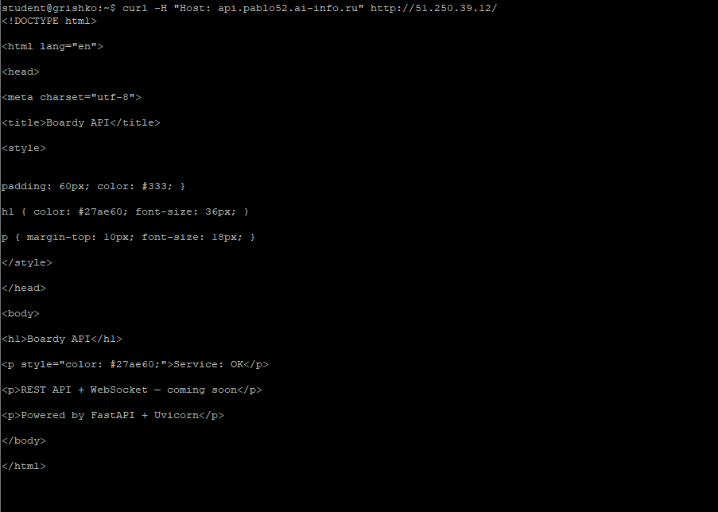 — GET-запрос к поддомену API (заглушка "Boardy API — Service: OK")

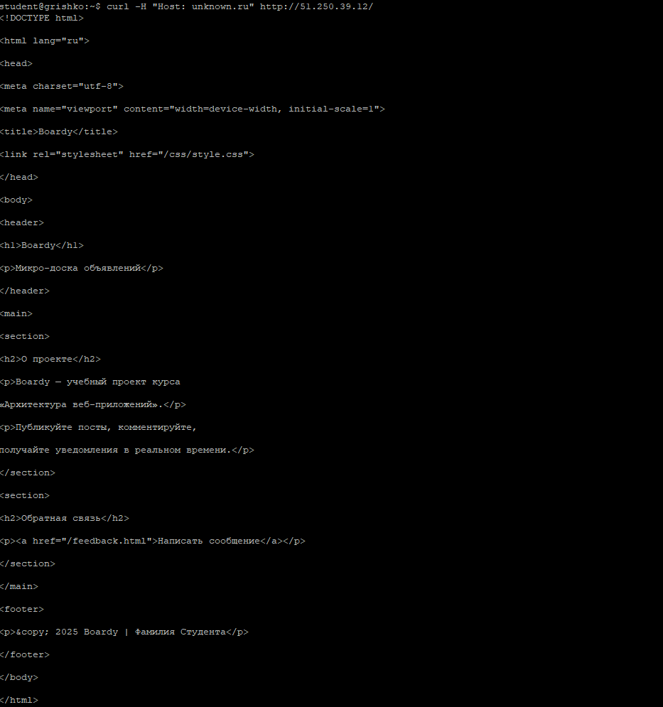 — Запрос с неизвестным Host (первый сайт по умолчанию)

## 5. HTTP-методы

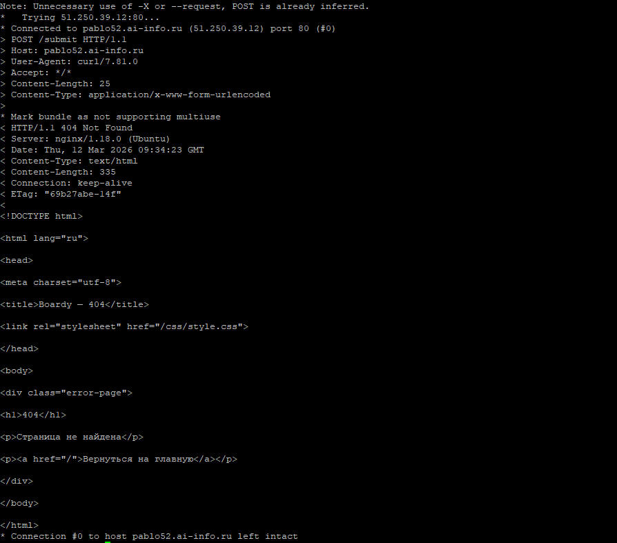 — Отправка формы методом POST (ответ 405 Method Not Allowed)

## 6. Логи сервера

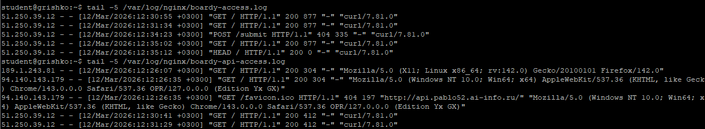 — Вывод `tail -5` для access-логов обоих сайтов

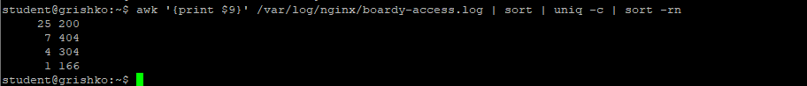 — Анализ логов с подсчетом запросов

---

**Вывод:** В ходе лабораторной работы были настроены два виртуальных хоста на одном сервере, исследованы HTTP-методы (GET, POST, HEAD), проанализированы логи и поведение сервера при разных заголовках Host.
