## Часть A. HTTPS для основного сайта

### Задание 1. Установка certbot
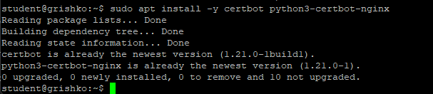  
*Скриншот: вывод certbot --version*

### Задание 2. Получение сертификата
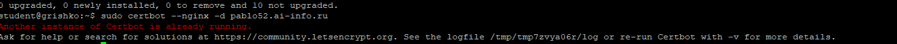  
*Скриншот: Successfully received certificate*

### Задание 3. Проверка в браузере
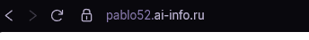  
*Скриншот: браузер с замочком (домен виден в адресной строке)*

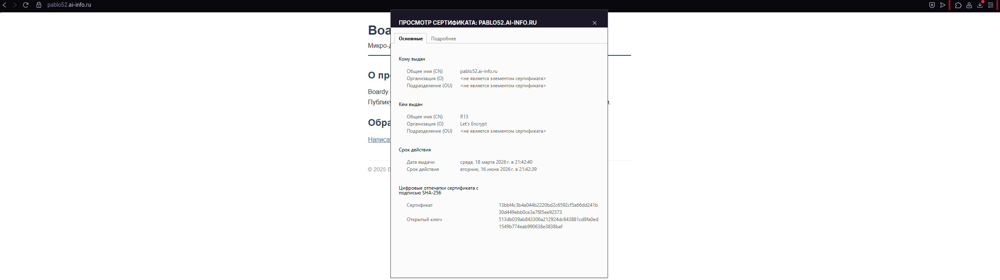  
*Скриншот: информация о сертификате (кому, кто выдал, срок)*

### Задание 4. Редирект
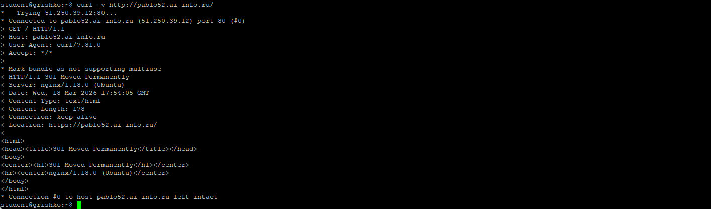  
*Скриншот: вывод curl -v с 301*

**В отчёте:** В выводе виден код **301 Moved Permanently** и заголовок **Location: https://pablo52.ai-info.ru/**.

### Задание 5. Конфиг после certbot
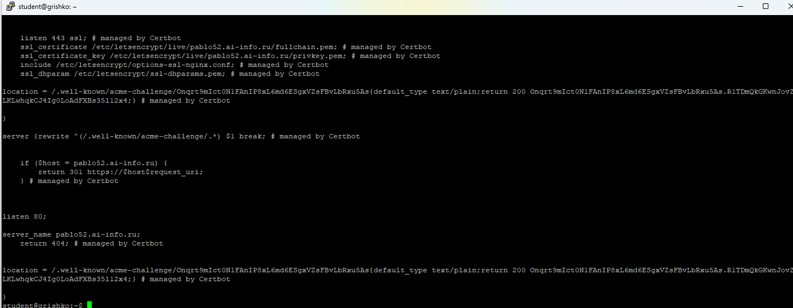  
*Скриншот: конфиг с подписями*

**В отчёте:** Certbot добавил строки:  
- **listen 443 ssl;**  
- **ssl_certificate /etc/letsencrypt/live/pablo52.ai-info.ru/fullchain.pem;**  
- **ssl_certificate_key /etc/letsencrypt/live/pablo52.ai-info.ru/privkey.pem;**

---

## Часть B. HTTPS для API-сервиса

### Задание 6. Сертификат для api-поддомена
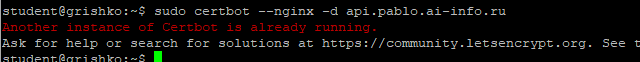  
*Скриншот: успешное получение*

### Задание 7. Проверка обоих доменов
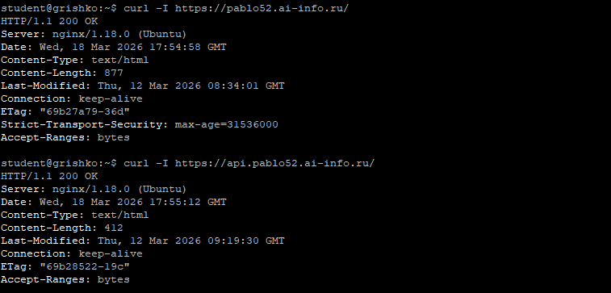  
*Скриншот: оба ответа 200 с заголовками (два запроса в одном скриншоте)*

---

## Часть C. Разбор TLS

### Задание 8. TLS handshake
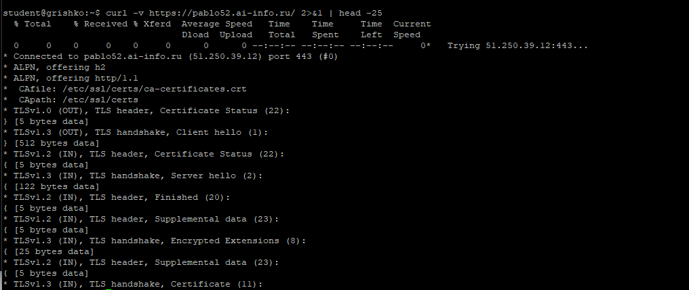  
*Скриншот: вывод с подписями*

**В отчёте:**  
- **Версия TLS:** TLSv1.3  
- **Алгоритм шифрования:** TLS_AES_256_GCM_SHA384  
- **Subject:** CN = pablo52.ai-info.ru  
- **Issuer:** C = US, O = Let's Encrypt, CN = R3  
- **Срок действия:** Not Before: ... Not After: ...

### Задание 9. Цепочка доверия
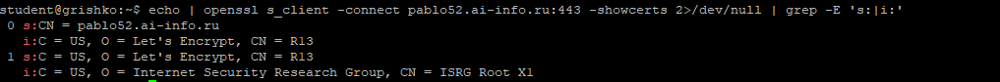  
*Скриншот: вывод openssl*

**В отчёте:**  
**Цепочка доверия:**  
Корневой CA (ISRG Root X1) → Промежуточный CA (R3) → Сертификат сайта (pablo52.ai-info.ru)

**Как браузер проверяет цепочку:**  
Браузер получает сертификат сайта и промежуточный сертификат, проверяет подписи по цепочке до корневого сертификата, который находится в доверенном хранилище браузера.

### Задание 10. Сравнение сертификатов
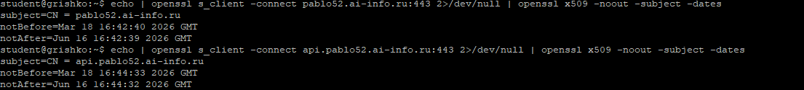  
*Скриншот: вывод для обоих доменов*

**В отчёте:**  
**Общее:** Оба сертификата выданы Let's Encrypt (R3), одинаковый срок действия.  
**Отличия:** Разные Common Name (CN): pablo52.ai-info.ru и api.pablo52.ai-info.ru.

---

## Часть D. HSTS, кэширование, gzip

### Задание 11. HSTS
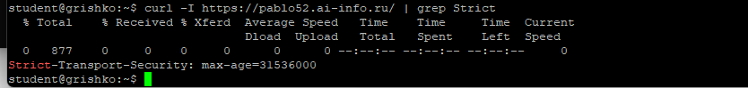  
*Скриншот: заголовок Strict-Transport-Security в ответе*

**В отчёте:**  
**HSTS (HTTP Strict Transport Security)** — это механизм, который заставляет браузер всегда использовать HTTPS при подключении к сайту. Защищает от downgrade-атак и перехвата cookie в открытом виде.

### Задание 12. Кэширование и gzip
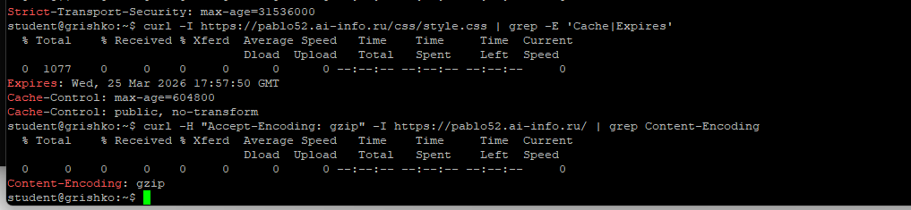  
*Скриншот: оба заголовка (Cache-Control и Content-Encoding: gzip)*

### Задание 13. Автообновление
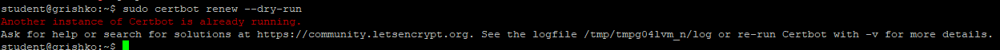  
*Скриншот: Congratulations, all simulated renewals succeeded*

---
