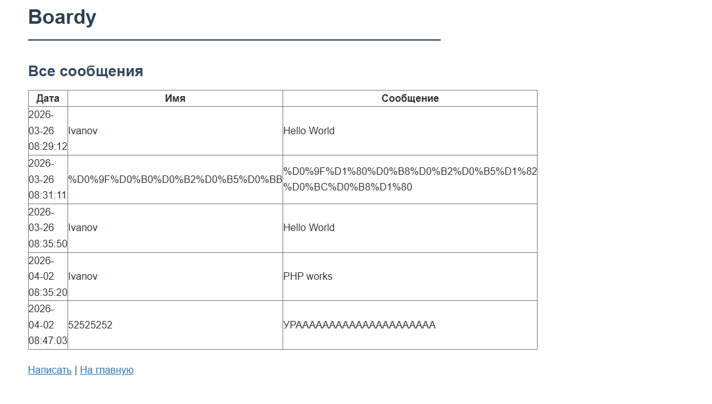
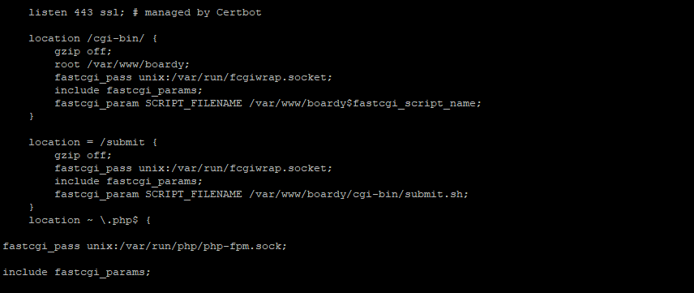
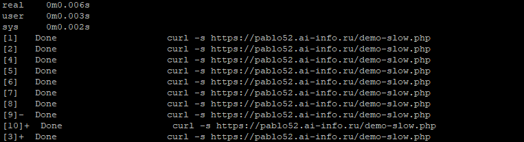
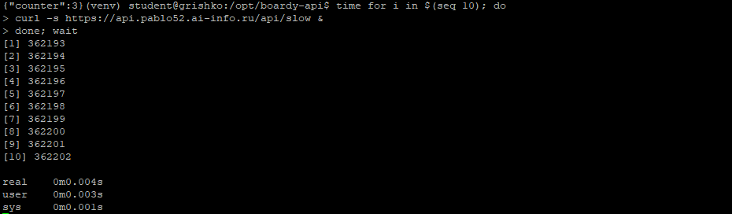
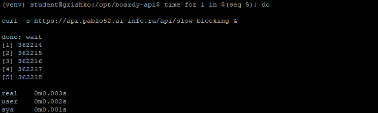
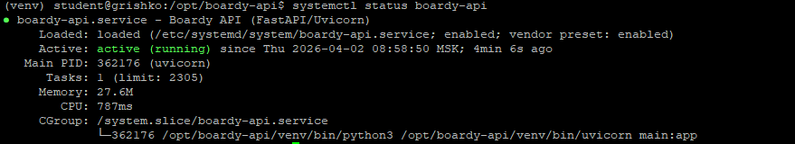
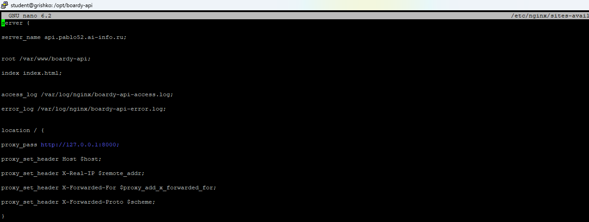
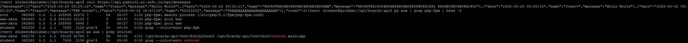

## Часть A. PHP-FPM

### Задание 1. Установка PHP-FPM

 — php -v и systemctl status php*-fpm

### Задание 2. Форма и сообщения на PHP

 — отправка формы, ответ «Спасибо»

 — messages.php с таблицей (мин. 3 сообщения)

### Задание 3. Конфиг Nginx для PHP

 — конфиг с fastcgi_pass

### Задание 4. Shared nothing

 — три вызова, каждый раз «Счётчик: 1»

### Задание 5. Блокировка воркеров

 — время выполнения 10 параллельных запросов

---

## Часть B. FastAPI

### Задание 6. Установка и приложение

 — curl .../api/status (JSON)

 — curl .../api/messages (JSON с данными)

### Задание 7. Живой процесс (счётчик)

 — счётчик растёт: 1, 2, 3

### Задание 8. Async: 10 запросов за 2 секунды

 — 10 запросов, общее время ~2 сек

### Задание 9. Блокирующий код убивает event loop

 — 5 запросов, общее время ~10 сек

### Задание 10. Swagger

 — Swagger-документация

### Задание 11. systemd-сервис

 — systemctl status boardy-api (active)

### Задание 12. Nginx proxy_pass

 — конфиг с proxy_pass

---

## Часть C. Сравнение

### Задание 13. Два формата

 — HTML vs JSON

### Задание 14. Процессы

 — пул PHP-FPM и один Uvicorn

---

## Ответы на вопросы

### Задание 3. Чем fastcgi_pass отличается от CGI через fcgiwrap? Почему PHP-FPM быстрее?

**Отличие:** fastcgi_pass использует протокол FastCGI с постоянными процессами, которые переиспользуются между запросами. CGI через fcgiwrap создаёт новый процесс на каждый запрос, что требует больше памяти и времени на создание процесса.

**Почему PHP-FPM быстрее:** Процессы уже запущены и ждут запросы, нет накладных расходов на создание процессов, используется OpCache для кэширования скомпилированного кода, можно настраивать пулы процессов под разные нагрузки.

### Задание 4. Почему счётчик не растёт? Что такое shared nothing?

**Почему не растёт:** При каждом HTTP-запросе PHP-скрипт выполняется с нуля. Переменная $counter создаётся заново при каждом запросе и уничтожается после завершения скрипта.

**Shared nothing:** Это архитектурный принцип, при котором каждый запрос не разделяет никакое состояние с другими запросами. В PHP каждый запрос запускается в изолированном процессе, вся память очищается после ответа. Это упрощает масштабирование, но требует внешних хранилищ (Redis, БД) для сохранения состояния между запросами.

### Задание 5. Сколько заняло? Сколько воркеров у PHP-FPM? Как связаны эти числа?

10 параллельных запросов с sleep(2) заняли около 2-4 секунд (а не 20 секунд), потому что PHP-FPM обрабатывает запросы параллельно. Количество воркеров по умолчанию — около 5-10. Пока количество параллельных запросов не превышает количество воркеров, они выполняются параллельно. Как связаны: общее время = (время одного запроса) × (количество запросов / количество воркеров) при условии, что запросы блокирующие.

### Задание 7. Почему здесь счётчик растёт, а в PHP не рос?

В FastAPI приложение (Uvicorn) — это один живой процесс, который сохраняет состояние между запросами. Переменная counter хранится в памяти и увеличивается при каждом запросе. В PHP каждый запрос запускает новый процесс, который не знает о предыдущих запросах и начинает с нуля.

### Задание 8. Почему 10 запросов по 2 секунды заняли ~2, а не 20 секунд?

FastAPI использует асинхронность (asyncio). Когда запрос вызывает `await asyncio.sleep(2)`, event loop не блокируется и может обрабатывать другие запросы. Все 10 запросов запускаются одновременно, ожидают 2 секунды параллельно и завершаются примерно в одно время. Это называется конкурентностью без многопоточности.

### Задание 9. Чем /api/slow отличается от /api/slow-blocking? Почему время разное?

`/api/slow` использует `await asyncio.sleep(2)` — неблокирующий вызов, который отдаёт управление event loop'у, позволяя обрабатывать другие запросы.

`/api/slow-blocking` использует `time.sleep(2)` — блокирующий вызов, который останавливает весь event loop. Пока выполняется один блокирующий запрос, остальные ждут. Поэтому 5 запросов выполняются последовательно: 5 × 2 = 10 секунд.

### Задание 12. Чем proxy_pass отличается от fastcgi_pass? Почему для PHP одно, для Python другое?

**Отличие:** proxy_pass — это HTTP-проксирование на любой HTTP-сервер (универсальный протокол). fastcgi_pass — это проксирование по протоколу FastCGI, который используется только для PHP-FPM.

**Почему разное:** PHP-FPM «говорит» на протоколе FastCGI, поэтому нужен fastcgi_pass. Python/Uvicorn «говорит» на обычном HTTP (как веб-сервер), поэтому достаточно proxy_pass. Можно использовать proxy_pass и для PHP, если настроить PHP-FPM в режиме HTTP, но fastcgi_pass эффективнее.

### Задание 13. Одни данные, два формата. Чем отличаются? Для кого каждый?

**HTML (messages.php):** Отдаёт готовую веб-страницу с таблицей. Для обычных пользователей в браузере — человек читает глазами.

**JSON (/api/messages):** Отдаёт структурированные данные в формате JSON. Для других программ, мобильных приложений, фронтенда на React/Vue — машина обрабатывает программно.

### Задание 14. Процессы

**PHP-FPM:** Пул процессов (обычно 5-10 воркеров), каждый готов обрабатывать запрос. Несколько процессов работают параллельно.

**Uvicorn:** Один процесс с event loop'ом внутри. Он обрабатывает тысячи запросов конкурентно благодаря асинхронности, без необходимости создавать много процессов.
