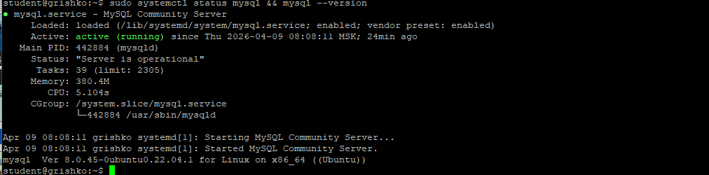
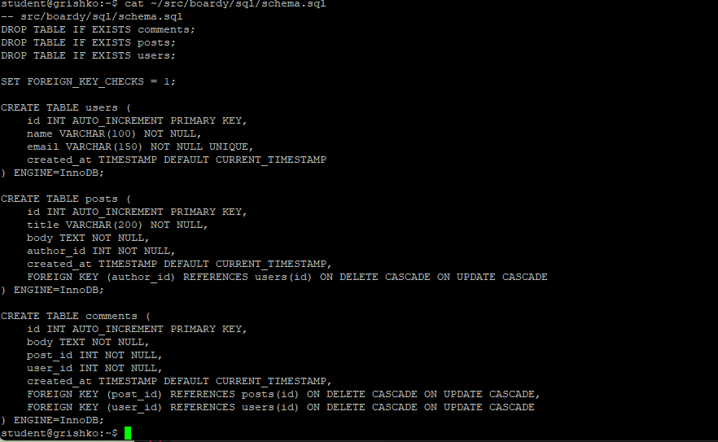
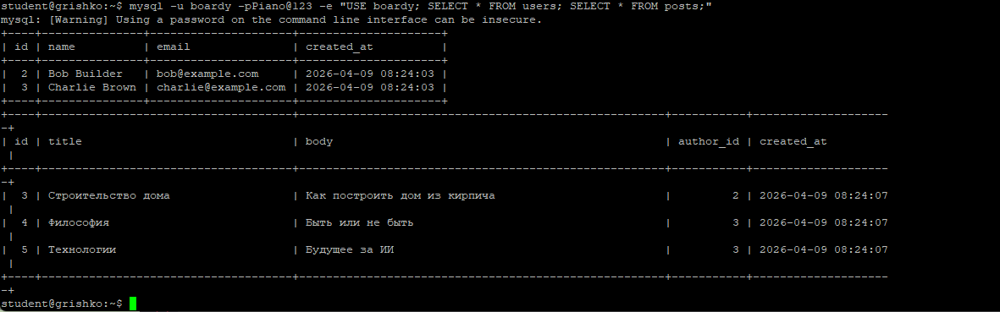
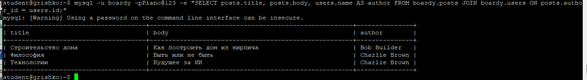
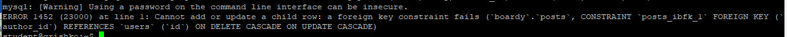
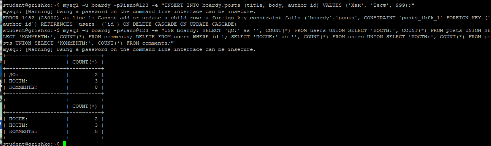
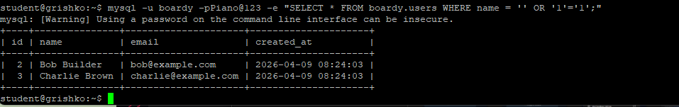
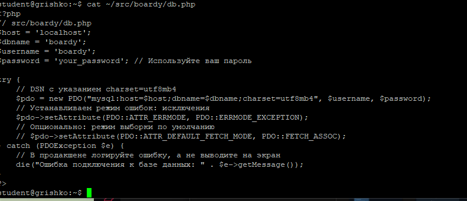
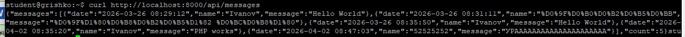
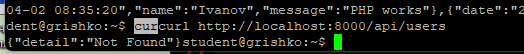

## Часть A. MySQL — установка и настройка

### Задание 1. Установка MySQL

### Задание 2. База данных и пользователь

**Вопросы:**

- **Почему utf8mb4, а не utf8?**  
  utf8 в MySQL поддерживает только 3 байта на символ, эмодзи не влезают. utf8mb4 — полный Unicode (4 байта).

- **Что такое collation и зачем unicode_ci?**  
  Collation — правила сравнения строк. ci = case insensitive (регистронезависимо). unicode_ci даёт точную сортировку Unicode.

### Задание 3. phpMyAdmin

## Часть B. Таблицы и связи

### Задание 4. Три таблицы

**Вопросы:**

- **Что такое FOREIGN KEY и ON DELETE CASCADE?**  
  FOREIGN KEY — связь между таблицами для целостности данных. ON DELETE CASCADE — при удалении родительской записи удаляются все дочерние.

- **Какой движок используется и почему?**  
  InnoDB — единственный движок в MySQL, поддерживающий FOREIGN KEY и транзакции.

### Задание 5. SQL-скрипт

## Часть C. SQL — базовые операции

### Задание 6. INSERT

### Задание 7. SELECT + JOIN

**Зачем JOIN?**  
JOIN объединяет данные из двух таблиц в одном запросе. Без JOIN пришлось бы делать два отдельных запроса.

### Задание 8. Foreign Key — защита целостности

### Задание 9. CASCADE

### Задание 10. SQL-инъекция

**Как работает SQL-инъекция?**  
Злоумышленник вставляет SQL-код в поле ввода, меняя логику запроса. Prepared statement защищает, так как данные передаются отдельно от кода запроса.

## Часть D. PHP + MySQL

### Задание 11. db.php

### Задание 12. submit.php

### Задание 13. messages.php

## Часть E. FastAPI + MySQL

### Задание 14. aiomysql

## Ответы на вопросы

### Задание 3. Чем fastcgi_pass отличается от CGI через fcgiwrap? Почему PHP-FPM быстрее?

**Отличие:** `fastcgi_pass` использует протокол FastCGI с постоянными процессами, которые переиспользуются между запросами. CGI через `fcgiwrap` создаёт новый процесс на каждый запрос, что требует больше памяти и времени на создание процесса.

**Почему PHP-FPM быстрее:**
- Процессы уже запущены и ждут запросы
- Нет накладных расходов на создание процессов
- Используется OpCache для кэширования скомпилированного кода
- Можно настраивать пулы процессов под разные нагрузки

---

### Задание 4. Почему счётчик не растёт? Что такое shared nothing?

**Почему не растёт:** При каждом HTTP-запросе PHP-скрипт выполняется с нуля. Переменная `$counter` создаётся заново при каждом запросе и уничтожается после завершения скрипта.

**Shared nothing:** Архитектурный принцип, при котором каждый запрос не разделяет никакое состояние с другими запросами. В PHP каждый запрос запускается в изолированном процессе, вся память очищается после ответа. Это упрощает масштабирование, но требует внешних хранилищ (Redis, БД) для сохранения состояния между запросами.

---

### Задание 5. Сколько заняло? Сколько воркеров у PHP-FPM? Как связаны эти числа?

10 параллельных запросов с `sleep(2)` заняли около 2-4 секунд (а не 20 секунд), потому что PHP-FPM обрабатывает запросы параллельно.

Количество воркеров по умолчанию — около 5-10. Пока количество параллельных запросов не превышает количество воркеров, они выполняются параллельно.

**Связь:** общее время = (время одного запроса) × (количество запросов / количество воркеров) при условии, что запросы блокирующие.

---

### Задание 7. Почему здесь счётчик растёт, а в PHP не рос?

В FastAPI приложение (Uvicorn) — это один живой процесс, который сохраняет состояние между запросами. Переменная `counter` хранится в памяти и увеличивается при каждом запросе.

В PHP каждый запрос запускает новый процесс, который не знает о предыдущих запросах и начинает с нуля.

---

### Задание 8. Почему 10 запросов по 2 секунды заняли ~2, а не 20 секунд?

FastAPI использует асинхронность (asyncio). Когда запрос вызывает `await asyncio.sleep(2)`, event loop не блокируется и может обрабатывать другие запросы. Все 10 запросов запускаются одновременно, ожидают 2 секунды параллельно и завершаются примерно в одно время.

Это называется **конкурентностью без многопоточности**.

---

### Задание 9. Чем /api/slow отличается от /api/slow-blocking? Почему время разное?

| Эндпоинт | Код | Поведение |
|----------|-----|-----------|
| `/api/slow` | `await asyncio.sleep(2)` | Неблокирующий — отдаёт управление event loop'у |
| `/api/slow-blocking` | `time.sleep(2)` | Блокирующий — останавливает весь event loop |

**Почему время разное:** При блокирующем вызове event loop останавливается. Пока выполняется один блокирующий запрос, остальные ждут. Поэтому 5 запросов выполняются последовательно: `5 × 2 = 10 секунд`.

---

### Задание 12. Чем proxy_pass отличается от fastcgi_pass? Почему для PHP одно, для Python другое?

| Директива | Протокол | Для чего |
|-----------|----------|----------|
| `fastcgi_pass` | FastCGI | PHP-FPM |
| `proxy_pass` | HTTP | Uvicorn, Gunicorn, Node.js |

**Почему разное:**
- PHP-FPM «говорит» на протоколе FastCGI → нужен `fastcgi_pass`
- Python/Uvicorn «говорит» на обычном HTTP → достаточно `proxy_pass`

Можно использовать `proxy_pass` и для PHP, если настроить PHP-FPM в режиме HTTP, но `fastcgi_pass` эффективнее.

---

### Задание 13. Одни данные, два формата. Чем отличаются? Для кого каждый?

| Формат | Файл | Для кого | Особенности |
|--------|------|----------|-------------|
| **HTML** | `messages.php` | Обычные пользователи в браузере | Готовая веб-страница с таблицей |
| **JSON** | `/api/messages` | Программы, мобильные приложения, React/Vue | Структурированные данные для машинной обработки |

---

### Задание 14. Процессы

| Технология | Модель процессов | Особенности |
|------------|------------------|-------------|
| **PHP-FPM** | Пул процессов (обычно 5-10 воркеров) | Несколько процессов работают параллельно |
| **Uvicorn** | Один процесс с event loop'ом | Обрабатывает тысячи запросов конкурентно благодаря асинхронности |

---
