# Практика 9: REST API, SSR vs CSR, JavaScript, React

## Часть A. REST API

### Задание 1. Структура проекта

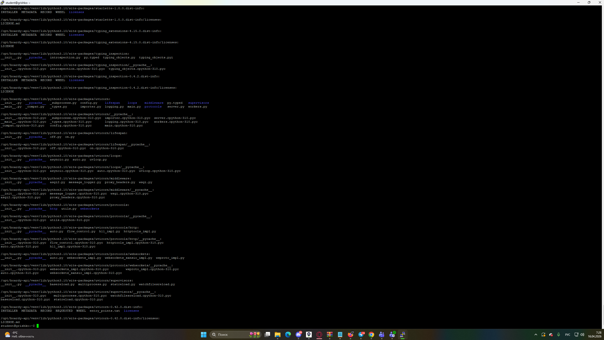

### Задание 2. GET — список комментариев

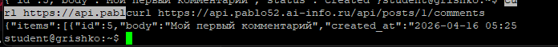

**Какой SQL-запрос выполняет этот эндпоинт?**

SELECT c.id, c.body, c.created_at, u.name AS author_name
FROM comments c
JOIN users u ON c.user_id = u.id
WHERE c.post_id = %s
ORDER BY c.created_at

**Зачем JOIN?** JOIN нужен, чтобы получить имя автора из таблицы users. Без JOIN мы получили бы только user_id.

### Задание 3. POST — создать комментарий

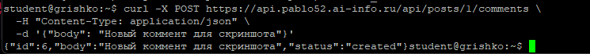

**Почему 201, а не 200?** 201 означает что ресурс создан. 200 — просто успех.

**Что означает Content-Type: application/json?** Сообщает серверу что тело запроса в формате JSON.

### Задание 4. PUT — редактировать

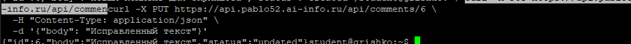

**Чем PUT отличается от POST?** POST создаёт новый ресурс, PUT обновляет существующий.

**Почему URL другой (/comments/{id})?** PUT обновляет конкретный комментарий по его ID, POST создаёт новый комментарий у конкретного поста.

### Задание 5. DELETE — удалить

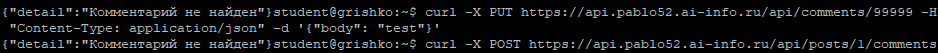

**Перечислите 4 HTTP-глагола. Какой код ответа у каждого и почему?**

GET — 200 (возвращает данные)
POST — 201 (создаёт ресурс)
PUT — 200 (обновляет существующий)
DELETE — 204 (удалили, нет содержимого)

### Задание 6. Ошибки

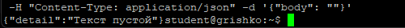

**Чем 404 отличается от 422?** 404 — ресурс не найден (неправильный ID). 422 — данные не прошли валидацию (пустой текст).

### Задание 7. Swagger

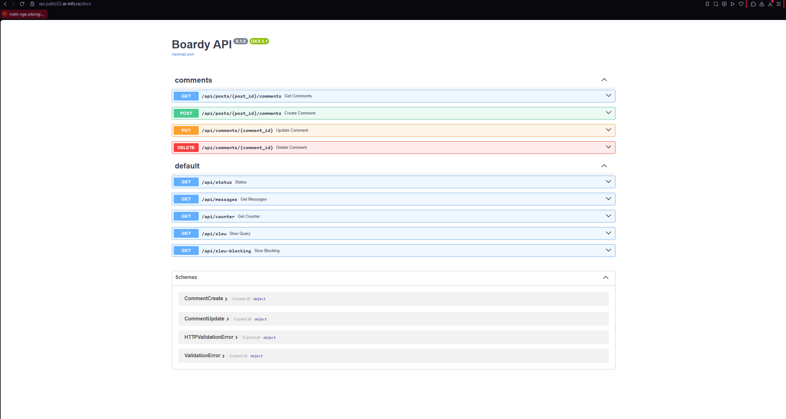

## Часть B. JavaScript-клиенты

### Задание 8. Vanilla JS — демо

**Что делает функция esc()?** Экранирует HTML-спецсимволы (<, >, &, "). Защищает от XSS.

**Что случится если её не вызвать?** Злоумышленник может вставить  и код выполнится.

### Задание 9. React — полный CRUD

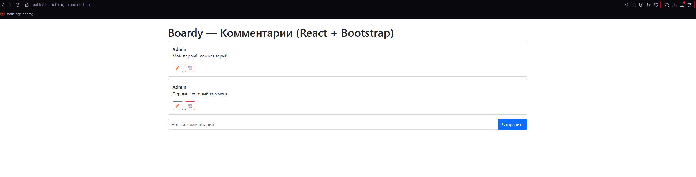

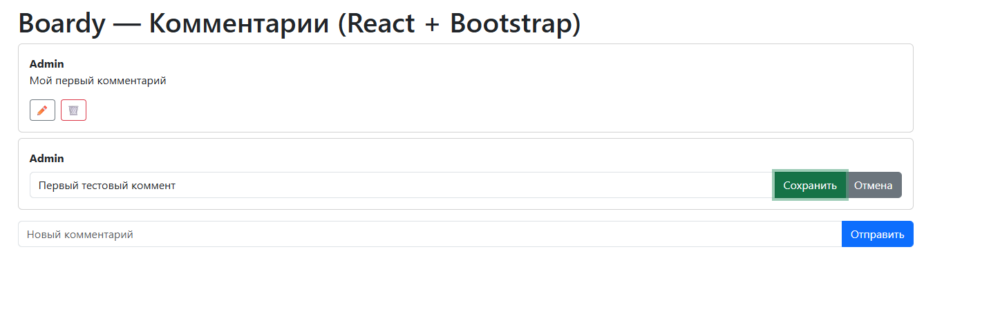

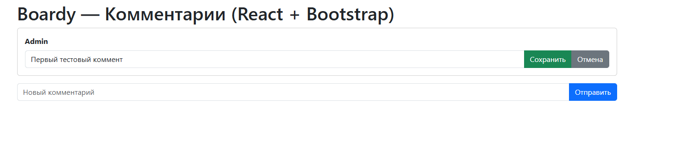

### Задание 10. Сравнение кода

**Где хранится состояние?** В vanilla JS — в DOM и глобальных переменных. В React — в useState.

**Как обновляется список после добавления?** В vanilla JS — innerHTML заново. В React — setItems() и React перерисовывает.

**Как реализовано редактирование?** В vanilla JS — подмена DOM вручную. В React — условный рендер (editId === item.id).

**Как защищаемся от XSS?** В vanilla JS — ручной вызов esc(). В React — автоматическое экранирование {item.body}.

### Задание 11. DevTools → Network

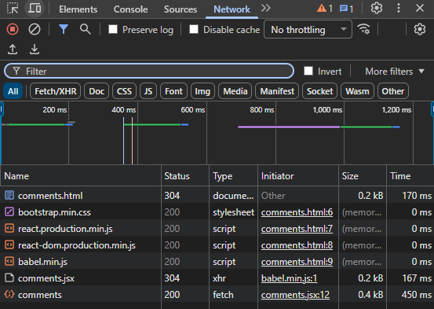

**Сколько запросов?** 5 запросов: HTML, CSS, React, ReactDOM, JSX, и запрос к API.

**Какой из них к API?** /api/posts/1/comments

## Часть C. SSR vs CSR

### Задание 12. View Source

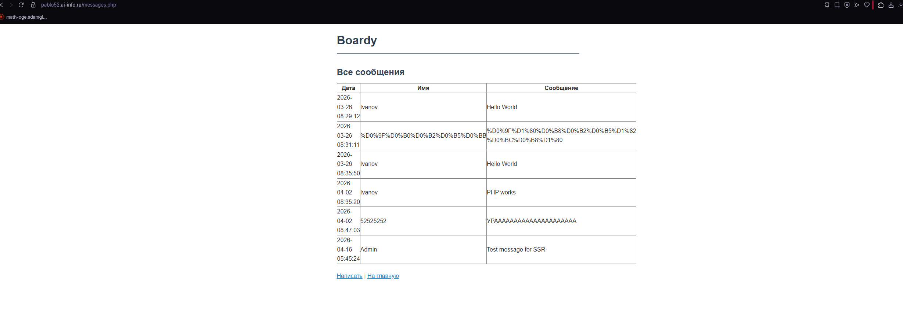

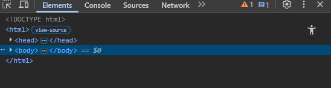

**Почему в CSR нет данных в исходнике?** Данные подгружаются через JS после загрузки страницы.

**Что увидит поисковый бот?** Пустую страницу, данные не проиндексируются.

### Задание 13. XSS

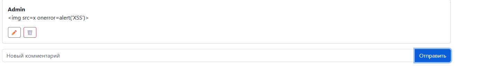

**Как vanilla JS и React защищаются от XSS?** Vanilla JS — esc() вручную. React — автоматически экранирует {item.body}.

**Какой способ надёжнее?** React, потому что защита включена по умолчанию, нельзя забыть вызвать.

### Задание 14. Итоговая таблица

| | SSR (PHP) | vanilla JS | React |
|---|---|---|---|
| Кто рендерит HTML | Сервер (PHP) | Браузер (JS) | Браузер (React) |
| Формат ответа сервера | HTML | JSON | JSON |
| View Source: данные видны? | Да | Нет | Нет |
| Перезагрузка при отправке | Да | Нет | Нет |
| Защита от XSS | Ручная (htmlspecialchars) | Ручная (esc()) | Автоматическая |
| Сложность кода | Средняя | Высокая | Средняя |

## Часть D. Pull Request

### Задание 15. PR на GitHub

