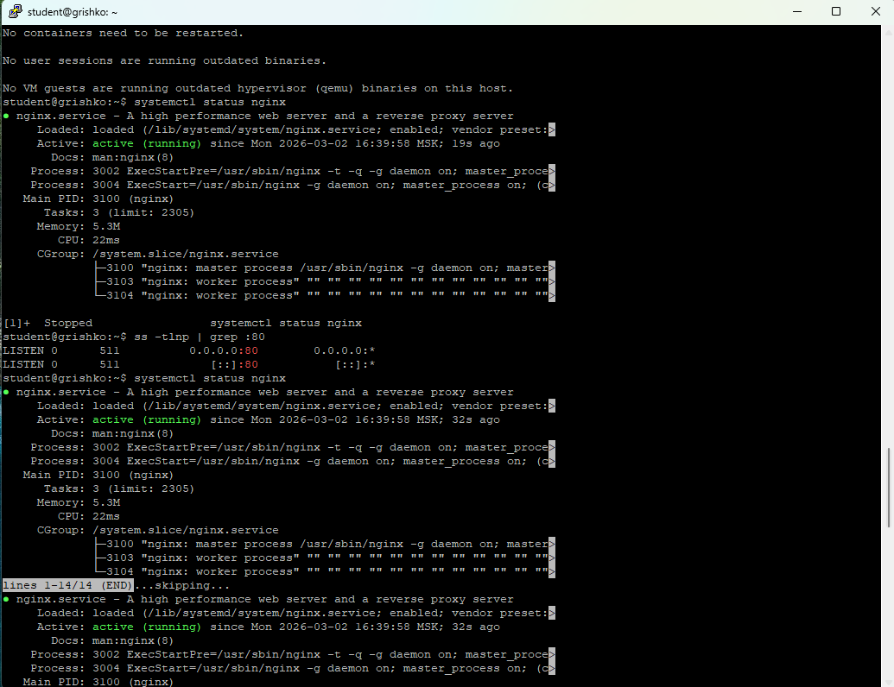
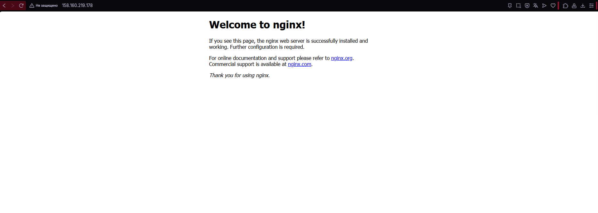
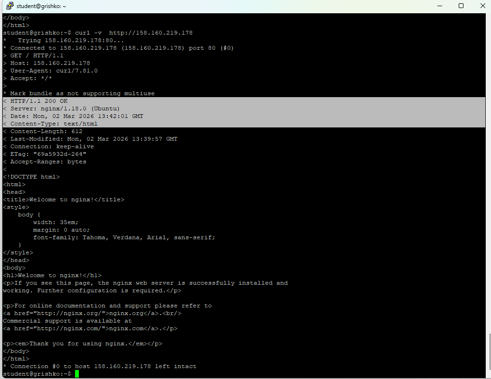
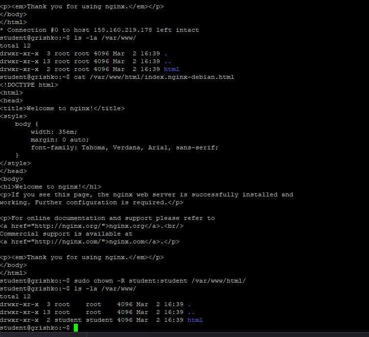
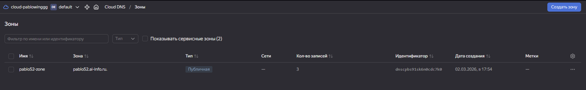
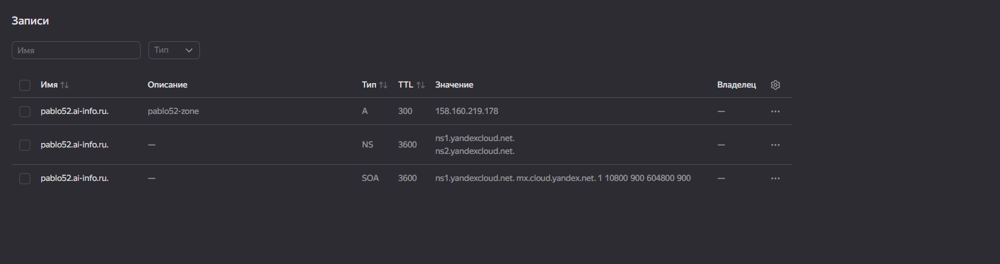
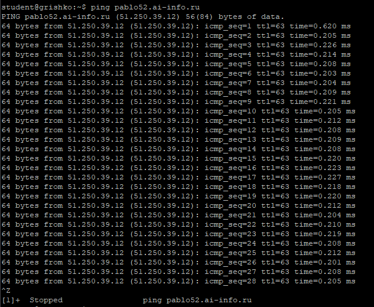
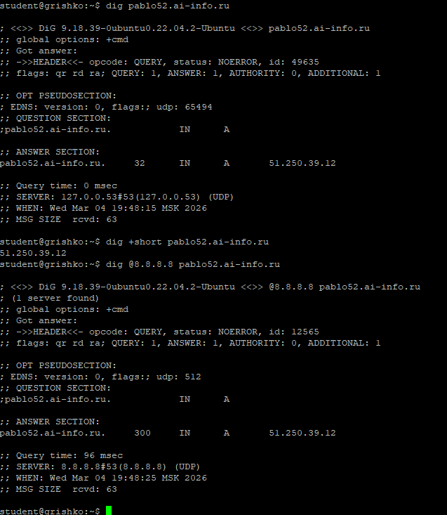
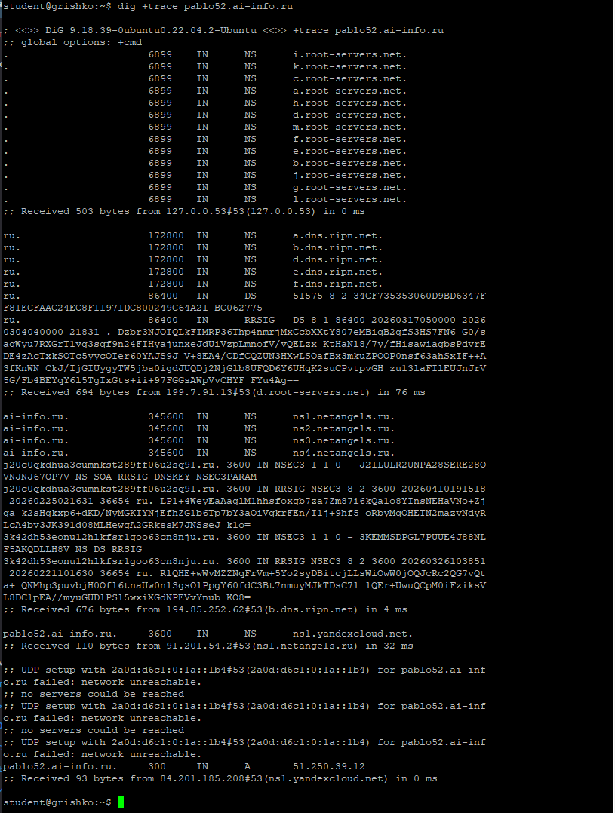
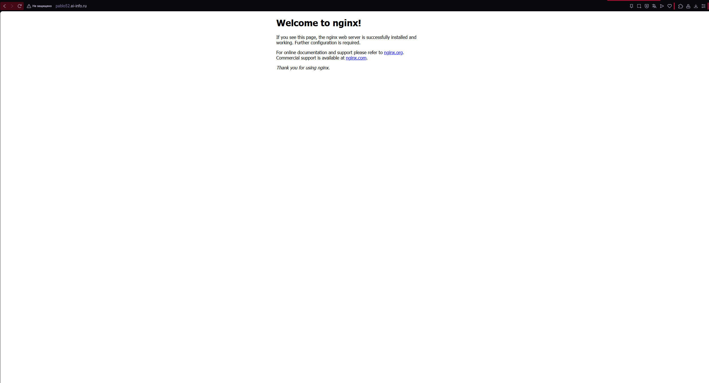

### Задание 1. Установка Nginx
 - `systemctl status nginx` (active)

### Задание 2. Страница по IP
 - Дефолтная страница Nginx по IP

### Задание 3. Проверка через curl
 - Вывод `curl -v http://158.160.219.178`
- GET / HTTP/1.1
- 200 OK
- Content-Type: text/html

### Задание 4. Директория и права
 - `ls -la /var/www/` до и после `chown`

### Задание 5. Конфигурация Nginx
**Директивы из `/etc/nginx/sites-available/default`:**

| Директива | Значение | Назначение |
|-----------|----------|------------|
| `listen` | 80 | Порт |
| `root` | /var/www/html | Папка с файлами |
| `server_name` | pablo52.ai-info.ru | Домен |
| `index` | index.html | Главный файл |

## Часть B. DNS

### Задание 6. DNS-зона
 - Зона `pablo52.ai-info.ru` в VK Cloud

### Задание 7. A-запись
 - A-запись: `pablo52.ai-info.ru` → 51.250.39.12, TTL 300

### Задание 8. Ping
 - `ping pablo52.ai-info.ru` (ответ от 51.250.39.12)

### Задание 9. Dig
 - `dig pablo52.ai-info.ru`

**QUESTION:** `pablo52.ai-info.ru. IN A`  
**ANSWER:** `pablo52.ai-info.ru. 32 IN A 51.250.39.12`  
**SERVER:** `127.0.0.53#53`

### Задание 10. Dig +trace
 - `dig +trace pablo52.ai-info.ru`

**4 шага:**
1. Корень (.) → 2. .ru → 3. NS ai-info.ru → 4. A-запись

### Задание 11. Сайт по домену
 - `http://pablo52.ai-info.ru` в браузере
